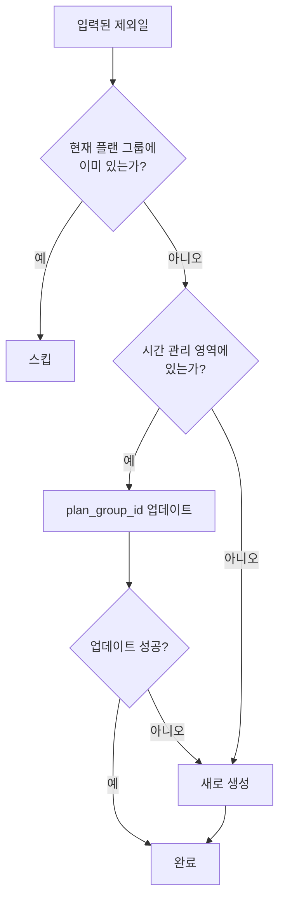
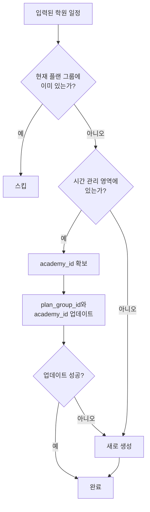

# 시간 관리 항목 재활용 및 중복 방지 구현

**작성일**: 2025-12-01  
**작성자**: AI Assistant

## 📋 개요

시간 관리에서 불러온 제외일과 학원 일정이 플랜 그룹 저장 시 새로운 레코드로 중복 생성되는 문제를 해결했습니다. 이제 시간 관리 영역의 항목을 재활용하여 `plan_group_id`만 업데이트하고, 없는 경우에만 새로 생성합니다.

## 🔍 문제 분석

### 기존 문제점

1. **제외일 중복 생성**
   - `plan_exclusions` 테이블에 같은 날짜+유형이 시간 관리 영역(plan_group_id=NULL)과 플랜 그룹 영역(plan_group_id=그룹ID)에 각각 저장
   - 중복 체크가 날짜만으로 이루어져 같은 날짜에 다른 유형의 제외일 구분 불가

2. **학원 일정 중복 생성**
   - `academy_schedules` 테이블에 같은 요일+시간이 시간 관리 영역과 플랜 그룹 영역에 각각 저장
   - 데이터베이스에 불필요한 중복 레코드 생성

3. **데이터 일관성 문제**
   - 시간 관리에서 항목을 수정해도 플랜 그룹에 반영되지 않음
   - 사용자가 같은 항목을 여러 번 등록해야 하는 불편함

## ✅ 구현 내용

### 1. 클라이언트 측 중복 체크 개선

#### 1.1 제외일 패널 (`ExclusionsPanel.tsx`)

**변경 사항**:
- 날짜만 체크하던 중복 체크를 **날짜+유형 조합**으로 변경
- `getExclusionKey` 함수 추가로 일관된 키 생성

**핵심 코드**:
```typescript
// 제외일 고유 키 생성 함수 (날짜 + 유형)
const getExclusionKey = (exclusion: {
  exclusion_date: string;
  exclusion_type: string;
}): string => {
  return `${exclusion.exclusion_date}-${exclusion.exclusion_type}`;
};

// 불러올 수 있는 제외일 개수 조회 시 날짜+유형 조합으로 체크
const existingKeys = new Set(data.exclusions.map(getExclusionKey));
const newCount = result.exclusions.filter(
  (e) => !existingKeys.has(getExclusionKey(e))
).length;

// 제외일 추가 시 중복 체크도 날짜+유형 조합으로
const duplicates = datesToAdd.filter((date) => 
  existingKeys.has(getExclusionKey({ exclusion_date: date, exclusion_type: newExclusionType }))
);
```

**효과**:
- 같은 날짜에 다른 유형(예: "시험 당일", "시험 전후일")의 제외일을 구분하여 관리 가능
- 더 정확한 중복 체크로 사용자 경험 개선

#### 1.2 제외일 불러오기 모달 (`ExclusionImportModal.tsx`)

**변경 사항**:
- `existingDatesSet`을 `existingKeys`로 변경
- 날짜+유형 조합으로 중복 체크

**핵심 코드**:
```typescript
// 기존 제외일 키 Set (날짜+유형 조합)
const existingKeys = useMemo(() => {
  return new Set(existingExclusions.map(getExclusionKey));
}, [existingExclusions]);

// 새로 추가 가능한 제외일 (날짜+유형 조합으로 체크)
const newExclusions = useMemo(() => {
  return filteredExclusions.filter(
    (e) => !existingKeys.has(getExclusionKey(e))
  );
}, [filteredExclusions, existingKeys]);

// 렌더링 시에도 날짜+유형 조합으로 체크
const exclusionKey = getExclusionKey(exclusion);
const isExisting = existingKeys.has(exclusionKey);
```

### 2. 서버 측 재활용 로직 구현

#### 2.1 제외일 재활용 (`createPlanExclusions`)

**변경 사항**: `lib/data/planGroups.ts` 의 `createPlanExclusions` 함수 전면 개편

**핵심 로직**:
```typescript
// 1. 현재 플랜 그룹의 기존 제외일 조회 (날짜+유형 조합)
const currentExclusions = await supabase
  .from("plan_exclusions")
  .select("id, exclusion_date, exclusion_type")
  .eq("student_id", group.student_id)
  .eq("plan_group_id", groupId);

const existingKeys = new Set(
  (currentExclusions || []).map(
    (e) => `${e.exclusion_date}-${e.exclusion_type}`
  )
);

// 2. 시간 관리 영역의 제외일 조회
const timeManagementExclusions = await supabase
  .from("plan_exclusions")
  .select("id, exclusion_date, exclusion_type, reason")
  .eq("student_id", group.student_id)
  .or(`plan_group_id.is.null,plan_group_id.neq.${groupId}`);

// 3. 키로 매핑
const timeManagementMap = new Map(
  (timeManagementExclusions || []).map((e) => [
    `${e.exclusion_date}-${e.exclusion_type}`,
    e,
  ])
);

// 4. 입력된 제외일을 3가지로 분류
for (const exclusion of exclusions) {
  const key = `${exclusion.exclusion_date}-${exclusion.exclusion_type}`;
  
  // 현재 플랜 그룹에 이미 있음 → 스킵
  if (existingKeys.has(key)) {
    continue;
  }
  
  // 시간 관리 영역에 있음 → plan_group_id 업데이트
  const timeManagementExclusion = timeManagementMap.get(key);
  if (timeManagementExclusion) {
    toUpdate.push({ id: timeManagementExclusion.id, exclusion });
  } else {
    // 둘 다 없음 → 새로 생성
    toInsert.push(exclusion);
  }
}

// 5. 업데이트 실행
for (const { id, exclusion } of toUpdate) {
  const { error: updateError } = await supabase
    .from("plan_exclusions")
    .update({
      plan_group_id: groupId,
      reason: exclusion.reason || null,
    })
    .eq("id", id);

  if (updateError) {
    // 업데이트 실패 시 새로 생성으로 폴백
    toInsert.push(exclusion);
  }
}

// 6. 새로 생성 실행
if (toInsert.length > 0) {
  await supabase.from("plan_exclusions").insert(payload);
}
```

**로그 메시지**:
- `[createPlanExclusions] 이미 존재하는 제외일 스킵: 2025-01-15-시험 당일`
- `[createPlanExclusions] 제외일 재활용 성공: 2025-01-15 (시험 전후일)`
- `[createPlanExclusions] 처리 요약: 업데이트 3개, 생성 2개, 스킵 1개`

#### 2.2 학원 일정 재활용 (`createPlanAcademySchedules`)

**변경 사항**: `lib/data/planGroups.ts` 의 `createPlanAcademySchedules` 함수 전면 개편

**핵심 로직**:
```typescript
// 1. 현재 플랜 그룹의 기존 학원 일정 조회
const existingSchedules = await getAcademySchedules(groupId, tenantId);
const existingKeys = new Set(
  existingSchedules.map((s) => 
    `${s.day_of_week}:${s.start_time}:${s.end_time}:${s.academy_name || ""}:${s.subject || ""}`
  )
);

// 2. 시간 관리 영역의 학원 일정 조회
const timeManagementSchedules = await supabase
  .from("academy_schedules")
  .select("id, day_of_week, start_time, end_time, academy_name, subject, academy_id")
  .eq("student_id", studentId)
  .or(`plan_group_id.is.null,plan_group_id.neq.${groupId}`);

// 3. 키로 매핑
const timeManagementMap = new Map(
  (timeManagementSchedules || []).map((s) => [
    `${s.day_of_week}:${s.start_time}:${s.end_time}:${s.academy_name || ""}:${s.subject || ""}`,
    s,
  ])
);

// 4. 입력된 학원 일정을 3가지로 분류
for (const schedule of schedules) {
  const key = `${schedule.day_of_week}:${schedule.start_time}:${schedule.end_time}:${schedule.academy_name || ""}:${schedule.subject || ""}`;
  
  // 현재 플랜 그룹에 이미 있음 → 스킵
  if (existingKeys.has(key)) {
    continue;
  }
  
  // 시간 관리 영역에 있음 → plan_group_id와 academy_id 업데이트
  const timeManagementSchedule = timeManagementMap.get(key);
  if (timeManagementSchedule) {
    toUpdate.push({ id: timeManagementSchedule.id, schedule });
  } else {
    // 둘 다 없음 → 새로 생성
    toInsert.push(schedule);
  }
}

// 5. 업데이트 실행 (academy 확보 후)
for (const { id, schedule } of toUpdate) {
  const academyName = schedule.academy_name || "학원";
  const academyId = await getOrCreateAcademy(academyName);
  
  if (!academyId) {
    toInsert.push(schedule); // 폴백
    continue;
  }

  await supabase
    .from("academy_schedules")
    .update({
      plan_group_id: groupId,
      academy_id: academyId,
      academy_name: schedule.academy_name || null,
      subject: schedule.subject || null,
    })
    .eq("id", id);
}

// 6. 새로 생성 실행
if (toInsert.length > 0) {
  await supabase.from("academy_schedules").insert(payload);
}
```

**로그 메시지**:
- `[createPlanAcademySchedules] 이미 존재하는 학원 일정 스킵: 1:14:00:15:30:수학학원:수학`
- `[createPlanAcademySchedules] 학원 일정 재활용 성공: 2요일 16:00-18:00`
- `[createPlanAcademySchedules] 처리 요약: 업데이트 2개, 생성 1개, 스킵 1개`

## 🎯 재활용 로직 흐름

### 제외일 재활용 흐름



**단계별 설명**:

1. **현재 플랜 그룹의 기존 제외일 조회** (날짜+유형 키)
2. **시간 관리 영역의 제외일 조회**
3. **입력된 제외일을 3가지로 분류**:
   - 현재 플랜 그룹에 이미 있음 → **스킵**
   - 시간 관리 영역에 있음 → **plan_group_id 업데이트**
   - 둘 다 없음 → **새로 생성**
4. **업데이트 실패 시 새로 생성으로 폴백**

### 학원 일정 재활용 흐름



**단계별 설명**:

1. **현재 플랜 그룹의 기존 학원 일정 조회** (요일+시간+학원명+과목 키)
2. **시간 관리 영역의 학원 일정 조회**
3. **입력된 학원 일정을 3가지로 분류**:
   - 현재 플랜 그룹에 이미 있음 → **스킵**
   - 시간 관리 영역에 있음 → **plan_group_id와 academy_id 업데이트**
   - 둘 다 없음 → **새로 생성**
4. **업데이트 실패 시 새로 생성으로 폴백**

## 📊 예상 효과

### 1. 데이터 중복 방지
- 같은 제외일/학원 일정이 여러 번 저장되지 않음
- 데이터베이스 저장 공간 절약

### 2. 데이터 일관성
- 시간 관리에서 수정 시 플랜 그룹에도 반영됨
- 사용자가 한 곳에서만 관리하면 됨

### 3. 사용자 경험 개선
- 시간 관리에서 한 번 등록한 항목을 여러 플랜 그룹에서 재사용 가능
- 중복 등록 작업 불필요

### 4. 유연한 관리
- 제외일: 같은 날짜에 다른 유형의 제외일 구분 가능
- 학원 일정: 요일+시간+학원명+과목 조합으로 정확한 구분

## 🔧 변경된 파일 목록

### 클라이언트 측
1. **`app/(student)/plan/new-group/_components/_panels/ExclusionsPanel.tsx`**
   - `getExclusionKey` 함수 추가
   - 중복 체크 로직 변경 (날짜 → 날짜+유형)

2. **`app/(student)/plan/new-group/_components/_panels/_modals/ExclusionImportModal.tsx`**
   - `existingDatesSet` → `existingKeys` 변경
   - 중복 체크 로직 변경 (날짜 → 날짜+유형)

### 서버 측
3. **`lib/data/planGroups.ts`**
   - `createPlanExclusions` 함수: 재활용 로직 추가 (894-1037 라인)
   - `createPlanAcademySchedules` 함수: 재활용 로직 추가 (1318-1476 라인)

### 문서
4. **`docs/2025-12-01-time-management-item-reuse.md`** (신규)
   - 구현 내용 문서화

## 🧪 테스트 시나리오

### 제외일 테스트

#### 시나리오 1: 시간 관리에서 제외일 불러오기
1. **준비**:
   - 시간 관리에서 "2025-01-15", "시험 당일" 제외일 생성 (plan_group_id=NULL)
   - 새 플랜 그룹 생성 (2025-01-01 ~ 2025-01-31)

2. **실행**:
   - 플랜 그룹 편집 → 제외일 패널 → "시간 관리에서 불러오기"
   - "2025-01-15" 제외일 선택 후 등록

3. **예상 결과**:
   - 기존 제외일의 `plan_group_id`가 현재 플랜 그룹 ID로 업데이트됨
   - 새로운 레코드가 생성되지 않음
   - 로그: `[createPlanExclusions] 제외일 재활용 성공: 2025-01-15 (시험 당일)`

4. **검증**:
   ```sql
   SELECT * FROM plan_exclusions 
   WHERE exclusion_date = '2025-01-15' 
   AND exclusion_type = '시험 당일';
   -- 결과: 1개 레코드만 존재, plan_group_id가 현재 플랜 그룹 ID
   ```

#### 시나리오 2: 같은 날짜에 다른 유형의 제외일
1. **준비**:
   - 시간 관리에서 "2025-01-15", "시험 당일" 제외일 이미 존재
   - 플랜 그룹에서 "2025-01-15", "시험 전후일" 제외일 추가

2. **예상 결과**:
   - 두 제외일이 모두 저장됨 (날짜는 같지만 유형이 다름)
   - 중복 에러 발생하지 않음

#### 시나리오 3: 이미 플랜 그룹에 있는 제외일
1. **준비**:
   - 플랜 그룹에 "2025-01-15", "시험 당일" 제외일 이미 존재

2. **실행**:
   - 시간 관리에서 같은 제외일 불러오기 시도

3. **예상 결과**:
   - 클라이언트에서 이미 필터링되어 목록에 표시되지 않음
   - 서버에서도 스킵됨
   - 로그: `[createPlanExclusions] 이미 존재하는 제외일 스킵: 2025-01-15-시험 당일`

### 학원 일정 테스트

#### 시나리오 1: 시간 관리에서 학원 일정 불러오기
1. **준비**:
   - 시간 관리에서 "월요일 14:00-16:00 수학학원 수학" 일정 생성 (plan_group_id=NULL)
   - 새 플랜 그룹 생성

2. **실행**:
   - 플랜 그룹 편집 → 학원 일정 패널 → "시간 관리에서 불러오기"
   - 일정 선택 후 등록

3. **예상 결과**:
   - 기존 일정의 `plan_group_id`가 현재 플랜 그룹 ID로 업데이트됨
   - `academy_id`도 함께 업데이트됨
   - 새로운 레코드가 생성되지 않음
   - 로그: `[createPlanAcademySchedules] 학원 일정 재활용 성공: 1요일 14:00-16:00`

4. **검증**:
   ```sql
   SELECT * FROM academy_schedules 
   WHERE day_of_week = 1 
   AND start_time = '14:00' 
   AND end_time = '16:00'
   AND academy_name = '수학학원'
   AND subject = '수학';
   -- 결과: 1개 레코드만 존재, plan_group_id가 현재 플랜 그룹 ID
   ```

#### 시나리오 2: 이미 플랜 그룹에 있는 학원 일정
1. **준비**:
   - 플랜 그룹에 "월요일 14:00-16:00 수학학원 수학" 일정 이미 존재

2. **실행**:
   - 시간 관리에서 같은 일정 불러오기 시도

3. **예상 결과**:
   - 클라이언트에서 이미 필터링되어 목록에 표시되지 않음
   - 서버에서도 스킵됨
   - 로그: `[createPlanAcademySchedules] 이미 존재하는 학원 일정 스킵: 1:14:00:16:00:수학학원:수학`

#### 시나리오 3: academy 생성이 필요한 경우
1. **준비**:
   - 시간 관리에서 "새학원" 이름의 학원 일정 생성
   - `academies` 테이블에 "새학원" 없음

2. **실행**:
   - 플랜 그룹에서 해당 일정 불러오기

3. **예상 결과**:
   - `academies` 테이블에 "새학원" 자동 생성
   - 학원 일정 저장 시 생성된 academy_id 사용
   - 로그: `[createPlanAcademySchedules] 학원 생성 완료: 새학원`

## ⚠️ 주의 사항

### 1. 기존 데이터 영향 없음
- 기존에 저장된 중복 데이터는 그대로 유지됩니다 (삭제하지 않음)
- 새로 저장하는 데이터부터 재활용 로직이 적용됩니다

### 2. 폴백 메커니즘
- 업데이트 실패 시 자동으로 새로 생성으로 폴백됩니다
- 데이터 손실 가능성을 최소화합니다

### 3. 트랜잭션 미사용
- Supabase 클라이언트의 제약으로 트랜잭션을 사용하지 않습니다
- 개별 작업 실패 시 부분 성공이 발생할 수 있습니다
- 에러 로그를 통해 실패한 작업을 추적할 수 있습니다

### 4. 성능 고려사항
- 대량 데이터 처리 시 순차 업데이트로 인한 지연이 발생할 수 있습니다
- 일반적인 사용 케이스(10~20개 항목)에서는 성능 문제가 없습니다

### 5. 데이터베이스 쿼리 증가
- 시간 관리 영역 조회를 위한 추가 쿼리가 발생합니다
- 하지만 중복 레코드 생성을 방지하여 장기적으로는 성능 이득입니다

## 📈 성능 분석

### 쿼리 수 비교

**기존 방식** (항목 N개):
- 중복 체크 쿼리: 1회
- INSERT 쿼리: 1회
- **총 2회**

**새로운 방식** (항목 N개, 재활용 M개):
- 현재 플랜 그룹 조회: 1회
- 시간 관리 영역 조회: 1회
- UPDATE 쿼리: M회 (재활용 항목)
- INSERT 쿼리: 1회 (N-M개, 있는 경우)
- **총 3+M회**

**장점**:
- 중복 레코드 생성 방지로 데이터베이스 크기 감소
- 데이터 일관성 향상으로 조회 성능 개선

**단점**:
- 초기 저장 시 쿼리 수 증가 (2회 → 3+M회)
- 실시간 업데이트가 필요한 경우 부담 증가

**결론**:
- 일반적인 사용 케이스(M < 10)에서는 무시할 수준의 성능 차이
- 데이터 정합성과 사용자 경험 개선 효과가 더 큼

## 🔄 향후 개선 방안

### 1. 배치 업데이트 최적화
현재는 업데이트를 순차적으로 실행하지만, Supabase의 배치 업데이트 API를 사용하면 성능을 개선할 수 있습니다.

```typescript
// 현재 (순차 업데이트)
for (const { id, exclusion } of toUpdate) {
  await supabase
    .from("plan_exclusions")
    .update({ plan_group_id: groupId })
    .eq("id", id);
}

// 개선 (배치 업데이트 - 가능하다면)
const ids = toUpdate.map(({ id }) => id);
await supabase
  .from("plan_exclusions")
  .update({ plan_group_id: groupId })
  .in("id", ids);
```

### 2. 캐싱 도입
시간 관리 영역의 항목은 자주 변경되지 않으므로, React Query를 활용한 캐싱을 고려할 수 있습니다.

### 3. 비동기 처리
UI 블로킹을 방지하기 위해, 백그라운드에서 재활용 로직을 실행하는 방안을 검토할 수 있습니다.

### 4. 데이터 마이그레이션
기존 중복 데이터를 정리하는 마이그레이션 스크립트를 작성하여 데이터베이스를 최적화할 수 있습니다.

```sql
-- 중복 제외일 찾기
WITH duplicates AS (
  SELECT 
    student_id,
    exclusion_date,
    exclusion_type,
    COUNT(*) as count
  FROM plan_exclusions
  GROUP BY student_id, exclusion_date, exclusion_type
  HAVING COUNT(*) > 1
)
SELECT * FROM duplicates;

-- 중복 학원 일정 찾기
WITH duplicates AS (
  SELECT 
    student_id,
    day_of_week,
    start_time,
    end_time,
    academy_name,
    subject,
    COUNT(*) as count
  FROM academy_schedules
  GROUP BY student_id, day_of_week, start_time, end_time, academy_name, subject
  HAVING COUNT(*) > 1
)
SELECT * FROM duplicates;
```

## 📚 참고 자료

- 이전 개선: `docs/학습-제외일-중복-방지-개선.md` (날짜만 체크)
- 데이터베이스 스키마: `supabase/migrations/`
- 요구사항: `timetable/1730Timetable-솔루션-요구사항-및-플랜-예시.md`

## ✅ 체크리스트

- [x] 클라이언트 측 중복 체크 개선 (날짜+유형)
- [x] 제외일 재활용 로직 구현
- [x] 학원 일정 재활용 로직 구현
- [x] 에러 처리 및 폴백 메커니즘
- [x] 로그 메시지 추가
- [x] 문서화 완료
- [ ] 실제 환경에서 테스트 (사용자 테스트 필요)
- [ ] 성능 모니터링
- [ ] 기존 중복 데이터 정리 (선택 사항)

## 📝 변경 이력

| 날짜 | 작성자 | 변경 내용 |
|------|--------|-----------|
| 2025-12-01 | AI Assistant | 초기 작성 및 구현 완료 |

---

**문의사항이나 개선 제안이 있으시면 개발팀에 연락해주세요.**

