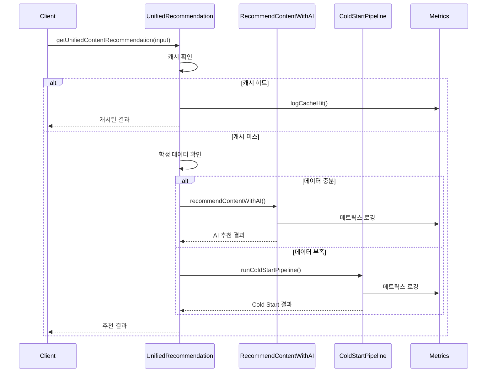

# LLM 콘텐츠 추천 시스템 아키텍처

> 작성일: 2026-01-18
> 최종 업데이트: 2026-01-18
> 상태: Production Ready

## 1. 개요

LLM 기반 콘텐츠 추천 시스템은 학생에게 최적의 학습 콘텐츠를 추천합니다.

### 1.1 주요 기능

- **AI 추천**: 학생 데이터(성적, 학습 패턴) 기반 개인화 추천
- **Cold Start 추천**: 학생 데이터 없이 웹 검색 기반 추천
- **통합 API**: 자동 전략 선택 (캐시 → AI 추천 → Cold Start)
- **성능 메트릭스**: 토큰/비용/응답시간 추적

### 1.2 기술 스택

- **LLM Provider**: Gemini (기본), Claude, OpenAI
- **웹 검색**: Gemini Grounding, Tavily API
- **캐시**: 메모리 LRU 캐시 (1일 TTL)
- **DB**: Supabase (PostgreSQL)

---

## 2. 아키텍처

```
┌─────────────────────────────────────────────────────────────────┐
│                        Client (React)                           │
├─────────────────────────────────────────────────────────────────┤
│  ContentRecommendationWizard  │  WebSearchPanel  │  Student UI  │
└───────────────┬───────────────┴────────┬────────┴───────────────┘
                │                        │
                ▼                        ▼
┌─────────────────────────────────────────────────────────────────┐
│                     Server Actions                               │
├─────────────────────────────────────────────────────────────────┤
│  getUnifiedContentRecommendation()                              │
│       │                                                         │
│       ├──→ [캐시 확인] ──→ 캐시 히트 시 반환                    │
│       │                                                         │
│       ├──→ [학생 데이터 확인]                                   │
│       │       │                                                 │
│       │       ├──→ 데이터 충분 → recommendContentWithAI()       │
│       │       │                                                 │
│       │       └──→ 데이터 부족 → runColdStartPipeline()         │
│       │                                                         │
│       └──→ [결과 DB 저장 (선택)]                                │
└─────────────────────────────────────────────────────────────────┘
                │
                ▼
┌─────────────────────────────────────────────────────────────────┐
│                     LLM Providers                                │
├─────────────────────────────────────────────────────────────────┤
│  Gemini (fast/standard)  │  Claude  │  OpenAI                   │
│  + Grounding (웹 검색)    │          │                          │
└─────────────────────────────────────────────────────────────────┘
                │
                ▼
┌─────────────────────────────────────────────────────────────────┐
│                     Metrics System                               │
├─────────────────────────────────────────────────────────────────┤
│  MetricsBuilder  →  MetricsStore  →  Aggregator                 │
│       │                  │                │                     │
│       ▼                  ▼                ▼                     │
│  JSON 로깅           링 버퍼 저장      통계 집계                 │
└─────────────────────────────────────────────────────────────────┘
```

---

## 3. 주요 컴포넌트

### 3.1 Server Actions

| 액션 | 파일 경로 | 설명 |
|------|----------|------|
| `getUnifiedContentRecommendation` | `actions/unifiedContentRecommendation.ts` | 통합 API (자동 전략 선택) |
| `recommendContentWithAI` | `actions/recommendContent.ts` | AI 추천 (학생 데이터 필요) |
| `runColdStartPipeline` | `actions/coldStart/pipeline.ts` | Cold Start 추천 (웹 검색) |

### 3.2 Cold Start 파이프라인

```
lib/domains/plan/llm/actions/coldStart/
├── pipeline.ts           # 메인 파이프라인
├── validateInput.ts      # 입력 검증
├── buildQuery.ts         # 검색 쿼리 생성
├── executeSearch.ts      # 웹 검색 실행
├── parseResults.ts       # 결과 파싱
├── rankResults.ts        # 결과 정렬/필터링
├── persistence/          # DB 저장
│   ├── mappers.ts        # 데이터 변환
│   ├── duplicateCheck.ts # 중복 검사
│   └── saveRecommendations.ts
└── types.ts              # 타입 정의
```

### 3.3 메트릭스 시스템

```
lib/domains/plan/llm/metrics/
├── types.ts       # 메트릭스 타입 정의
├── logger.ts      # MetricsBuilder, 로깅 함수
├── store.ts       # 링 버퍼 저장소
├── aggregator.ts  # 집계 서비스
└── index.ts       # 모듈 export
```

---

## 4. 데이터 흐름

### 4.1 통합 추천 흐름



### 4.2 Cold Start 파이프라인 흐름

```
입력 → 검증 → 쿼리 생성 → 웹 검색 → 파싱 → 정렬 → [DB 저장] → 결과
```

---

## 5. API 레퍼런스

### 5.1 getUnifiedContentRecommendation

```typescript
interface UnifiedRecommendInput {
  tenantId: string;
  studentId?: string;
  subjectCategory: string;
  subject?: string;
  difficultyLevel?: string;
  contentType?: "book" | "lecture" | "all";
  maxResults?: number;       // 기본: 5
  useCache?: boolean;        // 기본: true
  forceColdStart?: boolean;  // 기본: false
  saveResults?: boolean;     // 기본: true
}

interface UnifiedRecommendResult {
  success: boolean;
  strategy?: "cache" | "recommend" | "coldStart";
  recommendations?: RecommendedContent[];
  stats?: {
    fromCache: number;
    fromWebSearch: number;
    newlySaved: number;
  };
  error?: string;
}
```

### 5.2 recommendContentWithAI

```typescript
interface RecommendContentInput {
  studentId: string;
  subjectCategories?: string[];
  maxRecommendations?: number;
  focusArea?: "weak_subjects" | "all_subjects" | "exam_prep";
  modelTier?: "fast" | "standard" | "advanced";
  enableWebSearch?: boolean;
  webSearchConfig?: {
    mode?: "dynamic" | "always";
    saveResults?: boolean;
  };
}
```

### 5.3 runColdStartPipeline

```typescript
interface ColdStartRawInput {
  subjectCategory: string;
  subject?: string;
  difficulty?: string;
  contentType?: "book" | "lecture";
}

interface ColdStartPipelineOptions {
  preferences?: UserPreferences;
  useMock?: boolean;
  saveToDb?: boolean;
  tenantId?: string | null;
}
```

---

## 6. 메트릭스 시스템

### 6.1 수집 메트릭스

| 필드 | 타입 | 설명 |
|------|------|------|
| `durationMs` | number | 전체 처리 시간 |
| `tokenUsage.inputTokens` | number | 입력 토큰 수 |
| `tokenUsage.outputTokens` | number | 출력 토큰 수 |
| `cost.estimatedUSD` | number | 예상 비용 |
| `recommendation.count` | number | 추천 수 |
| `recommendation.strategy` | string | 사용된 전략 |
| `cache.hit` | boolean | 캐시 히트 여부 |
| `error.occurred` | boolean | 에러 발생 여부 |

### 6.2 집계 API

```typescript
// 전체 통계
getAggregatedMetrics({ period: "24h" });

// 소스별 통계
getMetricsBySource({ period: "7d" });

// 시간대별 추이
getMetricsTimeSeries({ period: "24h", intervalMinutes: 60 });

// 에러 통계
getErrorStats({ period: "24h" });

// 비용 분석
getCostAnalysis({ period: "30d" });
```

### 6.3 REST API

```
GET /api/admin/llm-metrics?period=24h&view=all
```

---

## 7. 사용 예시

### 7.1 기본 추천

```typescript
import { getUnifiedContentRecommendation } from "@/lib/domains/plan/llm/actions/unifiedContentRecommendation";

const result = await getUnifiedContentRecommendation({
  tenantId: "tenant-uuid",
  subjectCategory: "수학",
  maxResults: 5,
});

if (result.success) {
  console.log(`전략: ${result.strategy}`);
  result.recommendations?.forEach((rec) => {
    console.log(`- ${rec.title} (${rec.source})`);
  });
}
```

### 7.2 강제 Cold Start

```typescript
const result = await getUnifiedContentRecommendation({
  tenantId: "tenant-uuid",
  subjectCategory: "수학",
  subject: "미적분",
  forceColdStart: true,
  saveResults: true,
});
```

### 7.3 메트릭스 조회

```typescript
import {
  getAggregatedMetrics,
  getCostAnalysis,
} from "@/lib/domains/plan/llm/metrics";

// 24시간 통계
const stats = getAggregatedMetrics({ period: "24h" });
console.log(`성공률: ${stats.successRate}%`);
console.log(`P95 응답시간: ${stats.p95DurationMs}ms`);

// 비용 분석
const cost = getCostAnalysis({ period: "30d" });
console.log(`예상 월간 비용: $${cost.projectedMonthlyCost}`);
```

---

## 8. 설정 및 환경 변수

```env
# LLM Provider API Keys
GOOGLE_AI_API_KEY=...
ANTHROPIC_API_KEY=...
OPENAI_API_KEY=...

# Tavily (웹 검색)
TAVILY_API_KEY=...
```

---

## 9. 테스트

```bash
# Cold Start 테스트
pnpm test lib/domains/plan/llm/actions/coldStart/

# 메트릭스 테스트
pnpm test lib/domains/plan/llm/metrics/

# 전체 LLM 테스트
pnpm test lib/domains/plan/llm/
```

---

## 10. 향후 개선 사항

1. **배치 처리**: 여러 학생 동시 추천
2. **A/B 테스트**: 전략별 효과 비교
3. **ML 피드백**: 추천 결과 학습
4. **대시보드 UI**: 메트릭스 시각화 페이지
