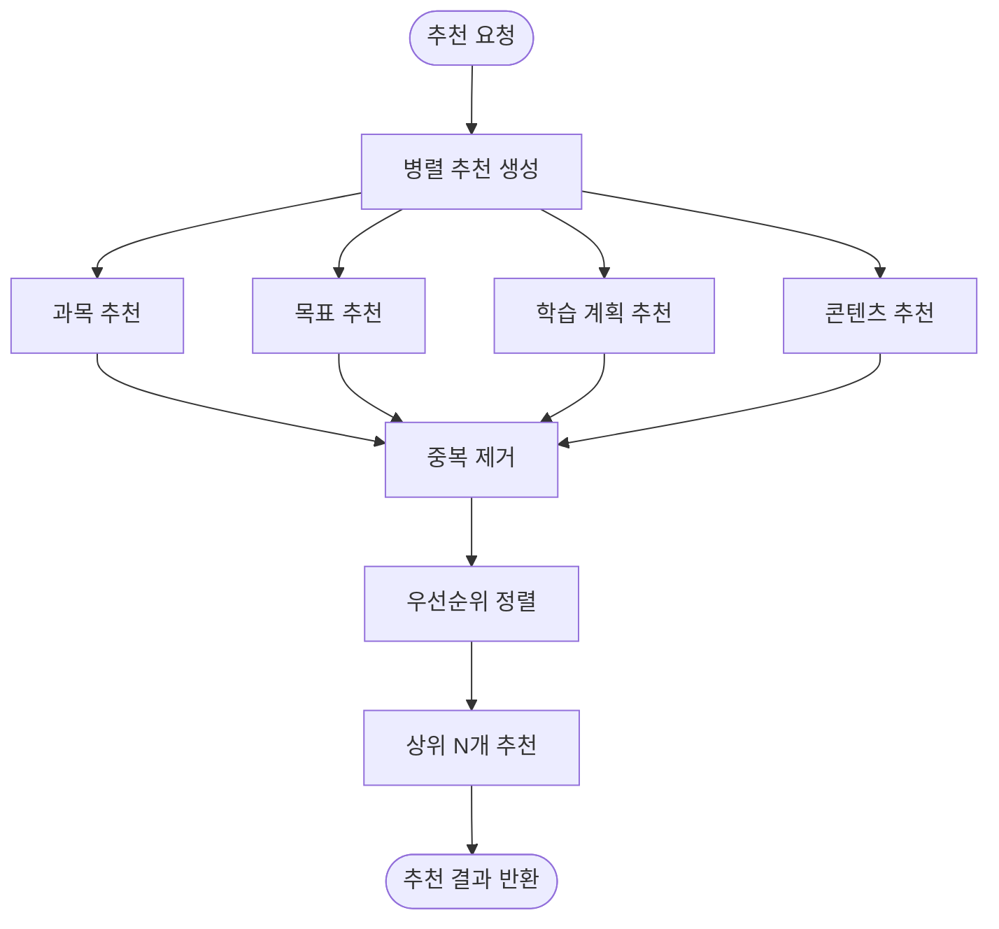
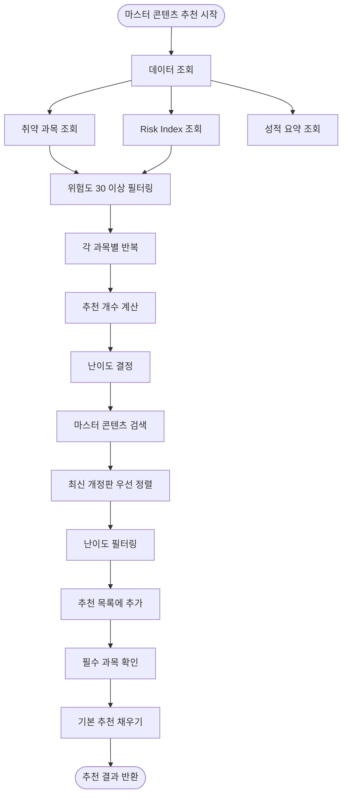
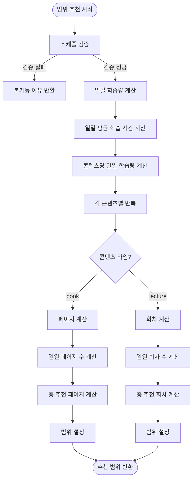
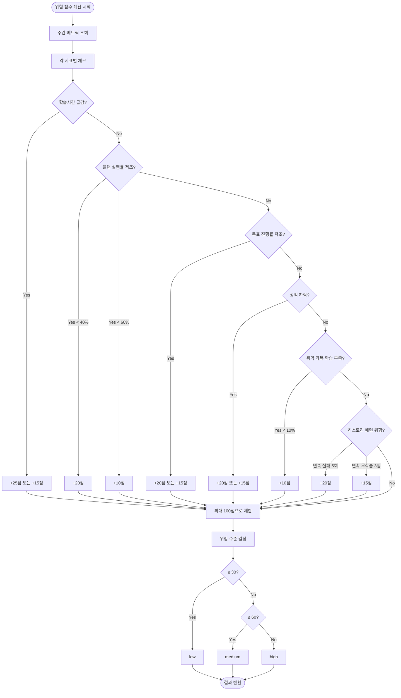
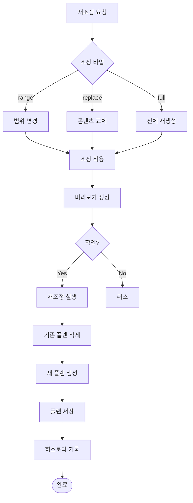
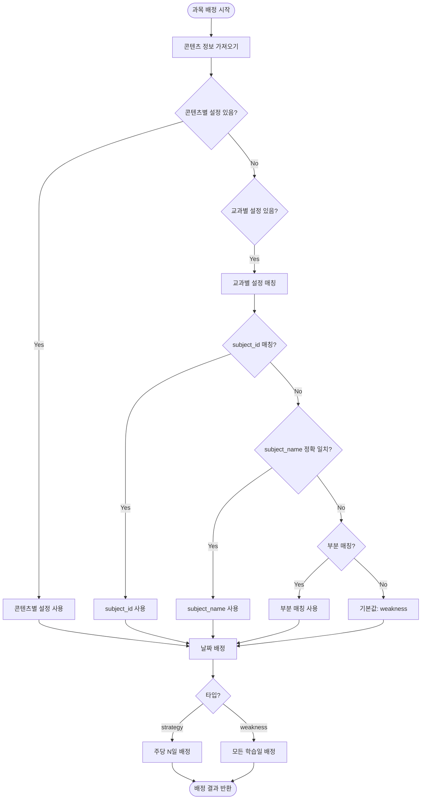
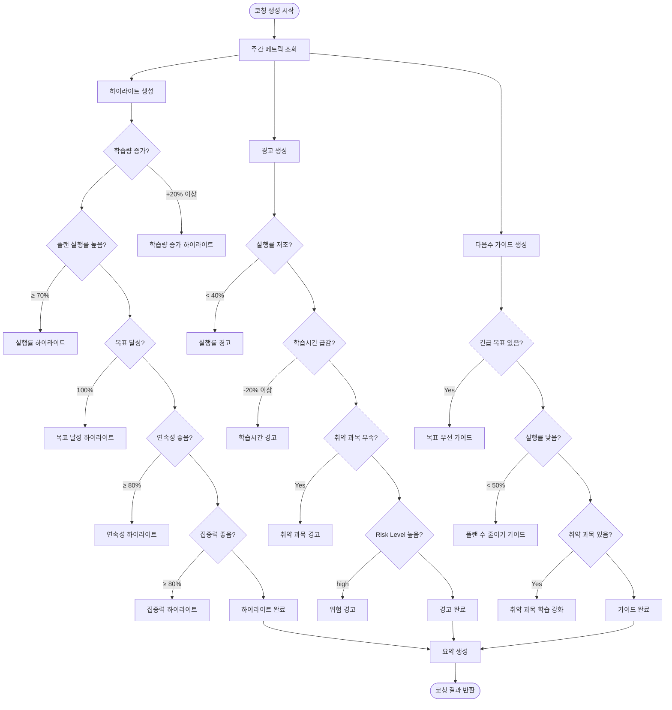
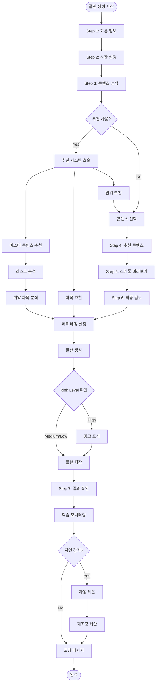
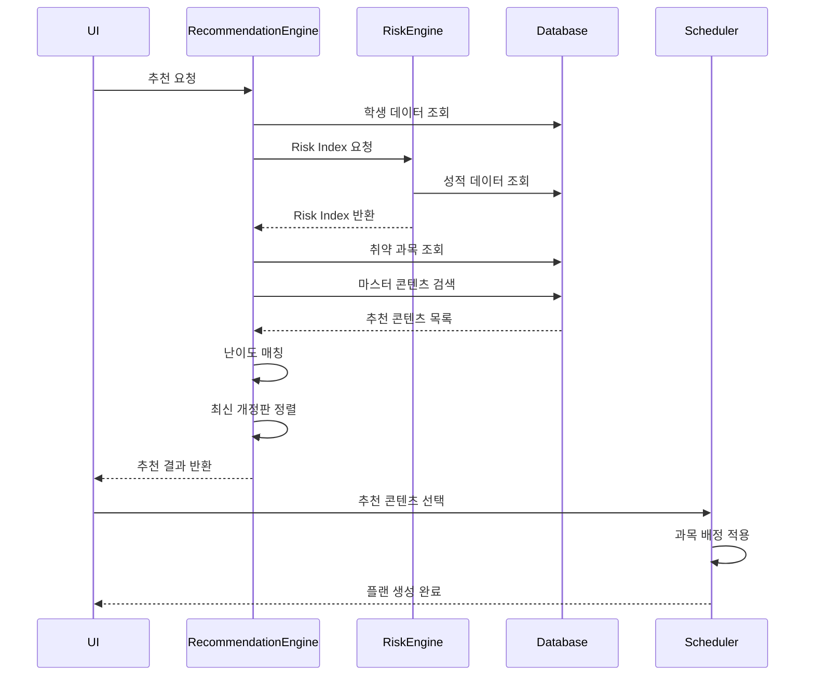
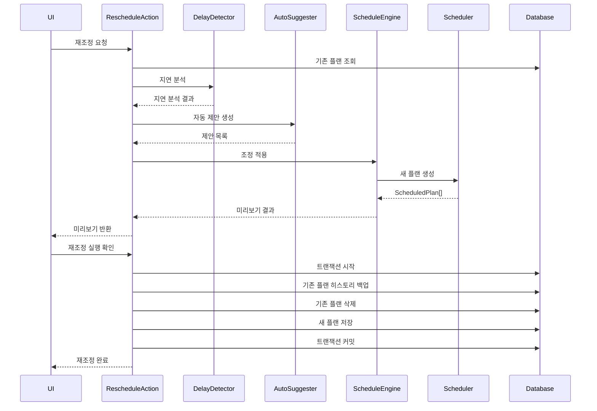

# 플랜 생성 관련 기능 분석

## 작성일: 2025-01-17

---

## 📋 목차

1. [개요](#개요)
2. [추천 시스템 (Recommendations)](#추천-시스템-recommendations)
3. [리스크 분석 (Risk Analysis)](#리스크-분석-risk-analysis)
4. [재조정 기능 (Reschedule)](#재조정-기능-reschedule)
5. [과목 배정 (Subject Allocation)](#과목-배정-subject-allocation)
6. [코칭 기능 (Coaching)](#코칭-기능-coaching)
7. [기능별 통합 흐름도](#기능별-통합-흐름도)

---

## 개요

플랜 생성은 단순히 학습 일정을 생성하는 것이 아니라, 학생의 데이터를 분석하고 맞춤형 추천을 제공하며, 리스크를 평가하고, 필요시 재조정하는 종합적인 시스템입니다.

**주요 관련 기능:**
- 추천 시스템: 콘텐츠, 과목, 범위 추천
- 리스크 분석: 위험 점수 계산 및 취약 과목 분석
- 재조정 기능: 플랜 재배치 및 자동 제안
- 과목 배정: 전략/취약 과목별 배정 전략
- 코칭 기능: 주간 학습 코칭 메시지 생성

---

## 추천 시스템 (Recommendations)

### 1. 통합 추천 엔진

**파일 위치:**
- `lib/recommendations/engine.ts`



**우선순위:**
1. 목표 추천 (goals)
2. 과목 추천 (subjects)
3. 학습 계획 추천 (studyPlan)
4. 콘텐츠 추천 (contents)

**주요 함수:**
```typescript
getRecommendations(supabase, studentId): Promise<Recommendations>
getTopRecommendations(recs, limit): string[]
```

---

### 2. 마스터 콘텐츠 추천

**파일 위치:**
- `lib/recommendations/masterContentRecommendation.ts`

**추천 로직:**



**추천 기준:**

1. **취약 과목 기반 추천**
   - Risk Score 30 이상 과목
   - 성적 수준에 따른 동적 개수 조정
   - 난이도 매칭

2. **필수 과목 보장**
   - 국어, 수학, 영어는 항상 포함
   - 요청된 과목도 필수로 처리

3. **성적 수준에 따른 추천 개수**
```typescript
function getRecommendationCount(riskScore: number, isWeak: boolean): {
  books: number;
  lectures: number;
}

// Risk Score 높을수록 더 많은 추천
// Risk 50-70: 책 1-2개, 강의 0-1개
// Risk 70+: 책 2-3개, 강의 1-2개
```

4. **난이도 매칭**
```typescript
function getRecommendedDifficultyLevel(
  schoolGrade: number | null,
  mockGrade: number | null
): "기초" | "기본" | "발전" | "심화" | null

// 등급에 따른 난이도 추천
// 7-9등급 → 기초
// 5-6등급 → 기본
// 3-4등급 → 발전
// 1-2등급 → 심화
```

**예시:**
```
취약 과목: 수학 (Risk Score: 75)
→ 추천 개수: 책 2개, 강의 1개
→ 난이도: 기본 (최근 내신 6등급)
→ 최신 개정판 우선 정렬
```

---

### 3. 학습 범위 추천

**파일 위치:**
- `lib/plan/rangeRecommendation.ts`

**추천 알고리즘:**



**계산 공식:**

```typescript
// 일일 평균 학습 시간
avgDailyHours = total_study_hours / total_study_days

// 콘텐츠당 일일 학습 시간
hoursPerContentPerDay = avgDailyHours / totalContents

// 교재: 일일 페이지 수
dailyPages = hoursPerContentPerDay * pagesPerHour (기본값: 10페이지/시간)
recommendedEnd = Math.min(dailyPages * total_study_days, total_pages)

// 강의: 일일 회차 수
dailyEpisodes = hoursPerContentPerDay * episodesPerHour (기본값: 2회차/시간)
recommendedEnd = Math.min(dailyEpisodes * total_study_days, total_episodes)
```

**예시:**
```
스케줄:
  - 총 학습일: 30일
  - 총 학습 시간: 90시간
  - 콘텐츠 수: 5개

계산:
  - 일일 평균: 90 / 30 = 3시간
  - 콘텐츠당 일일: 3 / 5 = 0.6시간 (36분)
  - 교재: 36분 × 10페이지/시간 = 6페이지/일
  - 추천 범위: 1 ~ 180페이지 (6 × 30일)
```

---

### 4. 과목 추천

**파일 위치:**
- `lib/recommendations/subjectRecommendation.ts`

**추천 규칙:**

1. **Rule 1: 취약 과목 학습시간 비중 부족**
   - 취약 과목인데 학습시간 비중 < 15%
   - 추천: "최근 4주 동안 [과목] 학습시간이 전체의 [비율]%에 불과합니다."

2. **Rule 2: 성적 하락 과목**
   - 최근 2회 연속 등급 하락
   - 추천: "[과목]는 최근 2회 연속 등급이 하락했습니다."

3. **Rule 3: 취약 과목인데 목표 없음**
   - 취약 과목으로 설정되었지만 목표가 없음
   - 추천: "[과목]에 대한 목표를 설정해보세요."

---

### 5. 콘텐츠 추천

**파일 위치:**
- `lib/recommendations/contentRecommendation.ts`

**추천 규칙:**

1. **Rule 1: 50% 미만 진행 중인 콘텐츠**
   - 진행률 0% < progress < 50%
   - 추천: "[콘텐츠]은 [진행률]% 진행되었습니다. 이번주에 [목표]%까지 끌어올리는 것을 추천합니다."

2. **Rule 2: 최근 사용하지 않은 콘텐츠**
   - 최근 2주 동안 사용 기록 없음
   - 추천: "[콘텐츠]을 다시 학습해보세요."

3. **Rule 3: 목표와 연관된 콘텐츠**
   - 활성 목표와 과목이 일치하는 콘텐츠
   - 추천: "[목표] 달성을 위해 [콘텐츠] 학습을 추천합니다."

---

## 리스크 분석 (Risk Analysis)

### 1. 위험 점수 계산

**파일 위치:**
- `lib/risk/engine.ts`

**위험 점수 계산 로직:**



**위험 지표 (Risk Indicators):**

1. **학습시간 급감** (+25 또는 +15점)
   - 이번주 학습시간이 지난주 대비 50% 미만: +25점
   - 70% 미만: +15점

2. **이번주 학습시간 부족** (+20 또는 +10점)
   - 5시간 미만: +20점
   - 10시간 미만: +10점

3. **플랜 실행률 저조** (+20 또는 +10점)
   - 실행률 < 40%: +20점
   - 실행률 < 60%: +10점

4. **목표 진행률 저조** (+20 또는 +15점)
   - 목표 2개 이상 곧 마감 + 진행률 저조: +20점
   - 목표 1개 3일 이내 마감 + 진행률 50% 미만: +15점

5. **성적 하락** (+20 또는 +15점)
   - 최근 2회 연속 등급 하락: +20점
   - 7등급 이하 과목 존재: +15점

6. **취약 과목 학습 부족** (+10점)
   - 취약 과목 학습시간 비율 < 10%

7. **히스토리 기반 위험 신호** (+20 또는 +15점)
   - 플랜 미완료 5회 연속: +20점
   - 학습세션 없는 날 3일 연속: +15점

**위험 수준:**
- **Low**: 0-30점
- **Medium**: 31-60점
- **High**: 61-100점

---

### 2. 취약 과목 분석

**파일 위치:**
- `lib/metrics/getWeakSubjects.ts`

**분석 기준:**
- Risk Score >= 50인 과목을 취약 과목으로 간주
- `student_analysis` 테이블에서 조회

**반환 데이터:**
```typescript
type WeakSubjectMetrics = {
  weakSubjects: string[]; // 취약 과목 목록
  subjectStudyTime: Map<string, number>; // 과목별 학습시간 (분)
  totalStudyTime: number; // 전체 학습시간 (분)
  weakSubjectStudyTimeRatio: number; // 취약 과목 학습시간 비율 (%)
};
```

---

## 재조정 기능 (Reschedule)

### 1. 재조정 개요

**파일 위치:**
- `app/(student)/actions/plan-groups/reschedule.ts`
- `lib/reschedule/scheduleEngine.ts`

**재조정 타입:**



---

### 2. 자동 제안 (Auto Suggester)

**파일 위치:**
- `lib/reschedule/autoSuggester.ts`

**제안 타입:**

1. **기한 연장 (extend_deadline)**
   - 학습 지연이 발생한 경우
   - 지연 일수 × 1.2로 기한 연장 제안

2. **일일 학습량 증가 (increase_daily_load)**
   - 일일 학습 시간을 늘려서 기한 내 완료 제안

3. **콘텐츠 범위 축소 (reduce_content_range)**
   - 학습 범위를 줄여서 완료 가능성 높임

4. **콘텐츠 교체 (replace_content)**
   - 더 적합한 콘텐츠로 교체 제안

5. **플랜 재분배 (redistribute_plans)**
   - 학습량을 더 균등하게 재분배

**제안 우선순위:**
- Critical: 5점
- High: 4점
- Medium: 3점
- Low: 2점
- Info: 1점

---

### 3. 지연 감지 (Delay Detector)

**파일 위치:**
- `lib/reschedule/delayDetector.ts`

**지연 심각도:**
- **Critical**: 지연 일수 >= 7일
- **High**: 지연 일수 >= 3일
- **Medium**: 지연 일수 >= 1일
- **Low**: 지연 일수 < 1일

---

### 4. 충돌 감지 (Conflict Detector)

**파일 위치:**
- `lib/reschedule/conflictDetector.ts`

**충돌 타입:**
- 시간 겹침
- 콘텐츠 중복
- 블록 초과
- 날짜 범위 초과

---

### 5. 패턴 분석 (Pattern Analyzer)

**파일 위치:**
- `lib/reschedule/patternAnalyzer.ts`

**분석 항목:**
- 학습 패턴 (요일별, 시간대별)
- 완료율 패턴
- 지연 패턴
- 취소 패턴

---

## 과목 배정 (Subject Allocation)

### 1. 전략/취약 과목 배정

**파일 위치:**
- `lib/plan/1730TimetableLogic.ts`
- `lib/utils/subjectAllocation.ts`

**배정 우선순위:**



**매칭 우선순위:**
1. `content_allocations` (콘텐츠별 설정)
2. `subject_allocations` (교과별 설정)
   - `subject_id`로 매칭 (가장 정확)
   - `subject_name`과 `subject_category` 정확 일치
   - `subject_name`에 `subject_category` 포함 확인 (부분 매칭)
   - `subject` 필드도 매칭
3. 기본값: `weakness` (취약과목)

---

### 2. 날짜 배정 알고리즘

**전략과목 배정:**
```typescript
// 주당 배정 일수 (weekly_days: 2, 3, 4)
// 각 주차에서 균등하게 분배
const step = weekDates.length / selectedCount;
for (let i = 0; i < selectedCount; i++) {
  const index = Math.floor((i + 0.5) * step);
  allocatedDates.push(weekDates[index]);
}
```

**취약과목 배정:**
- 모든 학습일에 배정
- 취약도 순서 우선 (Risk Score 높은 순)

---

## 코칭 기능 (Coaching)

### 1. 주간 코칭 엔진

**파일 위치:**
- `lib/coaching/engine.ts`

**코칭 메시지 구조:**

```typescript
type WeeklyCoaching = {
  highlights: string[]; // 이번주 잘한 점
  warnings: string[]; // 주의할 점
  nextWeekGuide: string[]; // 다음주 가이드
  summary: string; // 1줄 요약
};
```

**생성 로직:**



**하이라이트 규칙:**

1. 학습량 증가
   - 지난주 대비 +20% 이상: "학습량이 크게 늘었어요!"
   - +1% 이상: "학습량이 지난주보다 늘었어요!"

2. 플랜 실행률
   - ≥ 70%: "계획 실행력이 매우 좋습니다."
   - ≥ 60%: "계획 실행력이 양호합니다."

3. 목표 달성
   - 100%: "목표를 완주했어요!"
   - ≥ 80%: "목표 달성률이 높아요!"

4. 연속성 점수
   - ≥ 80%: "매일 꾸준히 학습하는 습관이 잘 형성되어 있어요!"
   - ≥ 60%: "학습 연속성이 좋아요!"

5. 집중 점수
   - ≥ 80%: "집중력이 뛰어나요!"
   - ≥ 60%: "집중해서 학습하는 모습이 보여요!"

**경고 규칙:**

1. 실행률 < 40%
2. 학습시간 급감 (-20% 이상)
3. 취약 과목 학습 부족
4. Risk Level이 high
5. 연속성 점수 < 40%
6. 집중 점수 < 40%
7. 목표 진행률 < 30%

**다음주 가이드:**

1. 긴급 목표 우선 처리
2. 플랜 실행률 낮음 → 플랜 수 줄이기
3. 취약 과목 학습 강화
4. 학습 시간 늘리기
5. 연속성 개선
6. 집중력 개선

---

## 기능별 통합 흐름도



---

## 주요 데이터 흐름

### 추천 시스템 데이터 흐름



### 재조정 데이터 흐름



---

## 기능별 연관성

### 추천 시스템 ↔ 리스크 분석

- 리스크 분석 결과를 바탕으로 추천 생성
- 취약 과목 (Risk Score >= 50) 기반 추천
- Risk Index를 활용한 추천 개수 및 난이도 결정

### 추천 시스템 ↔ 과목 배정

- 추천된 과목의 전략/취약 설정 자동 적용
- 취약 과목 추천 → weakness 배정
- 전략 과목 추천 → strategy 배정 (주당 N일)

### 리스크 분석 ↔ 코칭

- Risk Level에 따른 코칭 메시지 생성
- High Risk → 경고 메시지 강화
- Medium/Low Risk → 가이드 메시지 제공

### 재조정 ↔ 추천 시스템

- 재조정 시 추천 콘텐츠로 교체 제안
- 범위 축소 시 범위 추천 재계산

---

## 참고 문서

- `docs/plan-generation-comprehensive-guide.md`: 플랜 생성 과정 종합 가이드
- `lib/recommendations/`: 추천 시스템 구현
- `lib/risk/`: 리스크 분석 구현
- `lib/reschedule/`: 재조정 기능 구현
- `lib/coaching/`: 코칭 기능 구현
- `lib/utils/subjectAllocation.ts`: 과목 배정 유틸리티

---

**마지막 업데이트**: 2025-01-17
