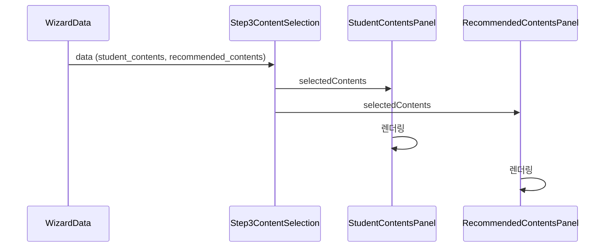
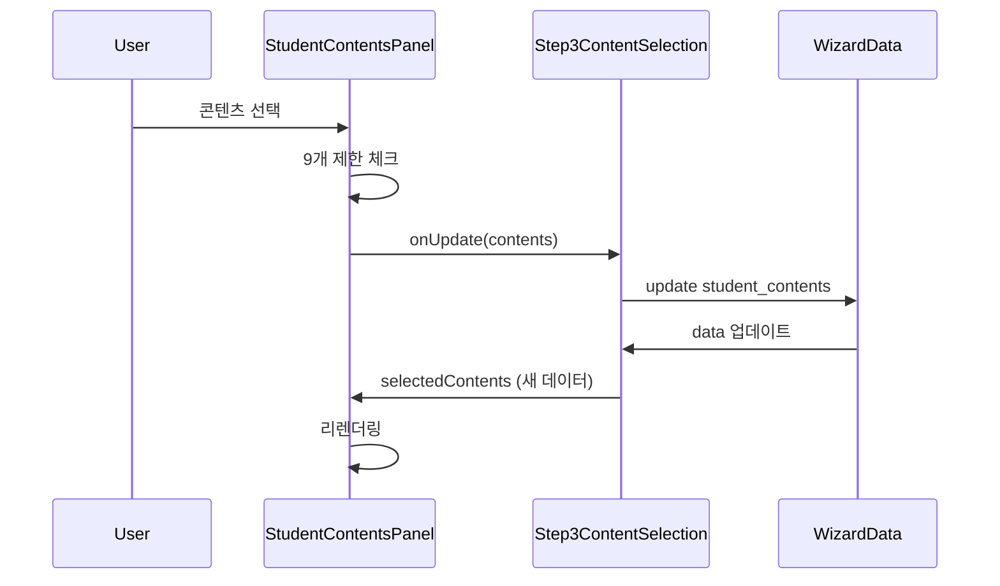
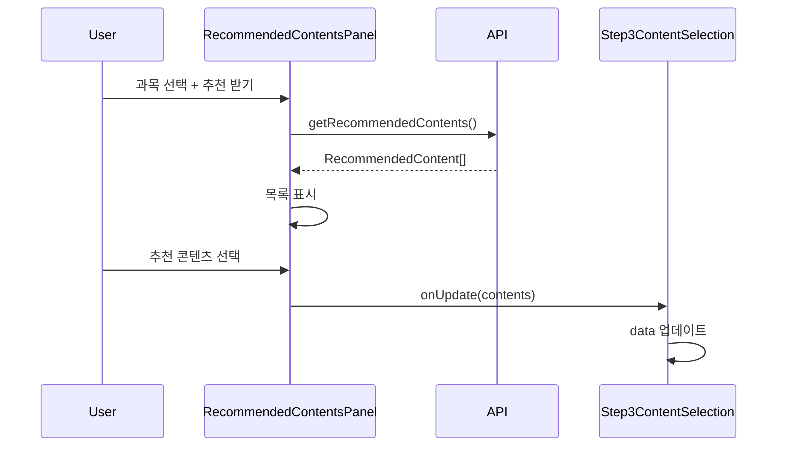
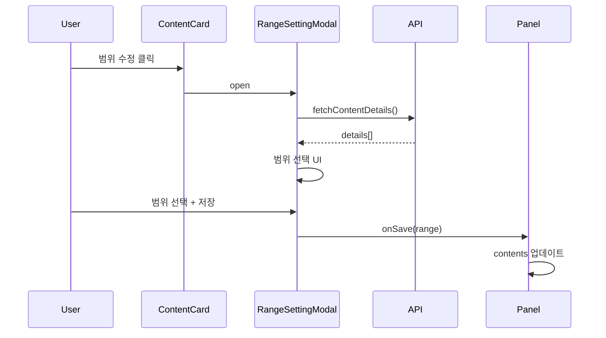

# 🎨 Wizard Phase 3 상세 설계

**작성일**: 2025년 11월 29일  
**Phase**: 3.1 - 상세 설계  
**소요 시간**: 4시간

---

## 📋 목차

1. [타입 정의](#타입-정의)
2. [상태 관리 전략](#상태-관리-전략)
3. [컴포넌트 구조](#컴포넌트-구조)
4. [데이터 흐름](#데이터-흐름)
5. [API 호출 플로우](#api-호출-플로우)
6. [다이어그램](#다이어그램)

---

## 1. 타입 정의

### ✅ 완료: `lib/types/content-selection.ts`

**주요 타입**:
- `SelectedContent` - 선택된 콘텐츠
- `RecommendedContent` - 추천 콘텐츠
- `ContentSelectionState` - 전체 상태
- `ContentCardProps` - 카드 컴포넌트
- `RangeSettingModalProps` - 범위 설정 모달

**총 22개 타입 정의 완료**

---

## 2. 상태 관리 전략

### 2.1 상태 위치 결정

#### 전역 상태 (WizardData에 저장)

```typescript
// PlanGroupWizard에서 관리
{
  student_contents: SelectedContent[],
  recommended_contents: SelectedContent[],
  schedule_summary: {...}
}
```

**이유**:
- Draft 자동 저장
- 단계 간 이동 시 유지
- 최종 제출 시 필요

#### 로컬 상태 (Step3ContentSelection에서 관리)

```typescript
// 컴포넌트 내부 상태
{
  activeTab: "student" | "recommended",
  selectedRecommendedIds: Set<string>,
  recommendationSettings: {...},
  isLoading: boolean,
  error: string | null
}
```

**이유**:
- UI 전용 상태
- 임시 상태
- 다른 단계와 무관

### 2.2 상태 동기화 전략

#### 상향식 (Child → Parent)

```typescript
// StudentContentsPanel
const handleUpdate = (contents: SelectedContent[]) => {
  onUpdate({ student_contents: contents });
};

// RecommendedContentsPanel
const handleUpdate = (contents: SelectedContent[]) => {
  onUpdate({ recommended_contents: contents });
};
```

#### 하향식 (Parent → Child)

```typescript
// Step3ContentSelection
<StudentContentsPanel
  selectedContents={data.student_contents}
  currentTotal={data.student_contents.length + data.recommended_contents.length}
/>
```

### 2.3 9개 제한 로직

**중앙 집중식 관리**:

```typescript
const maxContents = 9;
const currentTotal = studentContents.length + recommendedContents.length;
const canAddMore = currentTotal < maxContents;
const remaining = maxContents - currentTotal;
```

**전달 방식**:
- 각 패널에 `maxContents`, `currentTotal` 전달
- 각 패널에서 독립적으로 제한 체크
- 일관된 사용자 경험

---

## 3. 컴포넌트 구조

### 3.1 컴포넌트 계층

```
Step3ContentSelection (메인)
├── ProgressIndicator (진행률)
├── ContentSelectionTabs (탭 전환)
├── StudentContentsPanel (조건부 렌더링)
│   ├── ContentSelector (콘텐츠 선택)
│   ├── ContentCard[] (선택된 목록)
│   └── RangeSettingModal (범위 설정)
└── RecommendedContentsPanel (조건부 렌더링)
    ├── RecommendationSettings (추천 설정)
    ├── RecommendedContentCard[] (추천 목록)
    ├── ContentCard[] (선택된 목록)
    └── RangeSettingModal (범위 설정)

공통 컴포넌트 (_shared/)
├── ContentCard
├── RangeSettingModal
├── ContentRangeInput
└── ProgressIndicator
```

### 3.2 컴포넌트 책임

#### Step3ContentSelection (메인)

**책임**:
- 탭 상태 관리
- 전체 상태 통합
- Draft 자동 저장
- 9개 제한 체크

**Props**:
- WizardData (읽기/쓰기)
- contents (콘텐츠 목록)
- 모드 설정 (편집/읽기)

#### StudentContentsPanel

**책임**:
- 학생 콘텐츠 선택
- 범위 설정
- 메타데이터 조회

**Props**:
- selectedContents
- maxContents
- currentTotal
- onUpdate

#### RecommendedContentsPanel

**책임**:
- 추천 받기 설정
- 추천 콘텐츠 표시
- 추천 콘텐츠 선택
- 범위 설정

**Props**:
- recommendedContents
- selectedContents
- settings
- onUpdate
- onRequestRecommendations

---

## 4. 데이터 흐름

### 4.1 초기 로드



### 4.2 학생 콘텐츠 선택



### 4.3 추천 콘텐츠 요청



### 4.4 범위 설정



---

## 5. API 호출 플로우

### 5.1 API 목록

#### 콘텐츠 메타데이터

```typescript
// 사용처: 콘텐츠 선택 시
fetchContentMetadataAction(contentId: string, type: ContentType)
  → Promise<ContentMetadata>
```

#### 콘텐츠 상세 정보

```typescript
// 사용처: 범위 설정 모달
fetch(`/api/student-content-details?id=${id}&type=${type}`)
  → Promise<{ details: ContentDetail[] }>
```

#### 추천 콘텐츠

```typescript
// 사용처: 추천 받기
getRecommendedMasterContentsAction(studentId, subjects, counts)
  → Promise<RecommendedContent[]>
```

### 5.2 API 호출 타이밍

| API | 호출 시점 | 캐싱 | 에러 처리 |
|-----|----------|------|-----------|
| fetchContentMetadata | 콘텐츠 선택 시 | ✅ | Toast |
| fetchContentDetails | 모달 열릴 때 | ✅ | 모달 내 표시 |
| getRecommendedContents | 추천 받기 버튼 | ❌ | Toast + 재시도 |

### 5.3 에러 처리 전략

#### 재시도 가능한 에러

```typescript
try {
  const data = await fetchAPI();
} catch (error) {
  if (isNetworkError(error)) {
    // 재시도 버튼 표시
    setError("네트워크 오류. 다시 시도해주세요.");
  }
}
```

#### 복구 불가능한 에러

```typescript
catch (error) {
  if (isAuthError(error)) {
    // 로그인 페이지로 이동
    router.push("/login");
  }
}
```

---

## 6. 다이어그램

### 6.1 컴포넌트 구조도

```
┌─────────────────────────────────────────────────────────────┐
│ Step3ContentSelection                                       │
│                                                             │
│ ┌─────────────────────────────────────────────────────────┐ │
│ │ ProgressIndicator: 8/9개 선택 (국/수/영 필수)          │ │
│ └─────────────────────────────────────────────────────────┘ │
│                                                             │
│ ┌─────────────────────────────────────────────────────────┐ │
│ │ ContentSelectionTabs                                    │ │
│ │ [학생 콘텐츠 (5)] [추천 콘텐츠 (3)]                    │ │
│ └─────────────────────────────────────────────────────────┘ │
│                                                             │
│ ┌─────────────────────────────────────────────────────────┐ │
│ │ StudentContentsPanel (activeTab === "student")          │ │
│ │                                                         │ │
│ │ ┌───────────────────────────────────────────────────┐   │ │
│ │ │ ContentSelector                                   │   │ │
│ │ │ [교재] [강의] [커스텀]                            │   │ │
│ │ └───────────────────────────────────────────────────┘   │ │
│ │                                                         │ │
│ │ ┌───────────────────────────────────────────────────┐   │ │
│ │ │ ContentCard (국어 교재)                           │   │ │
│ │ │ ContentCard (수학 교재)                           │   │ │
│ │ │ ...                                               │   │ │
│ │ └───────────────────────────────────────────────────┘   │ │
│ └─────────────────────────────────────────────────────────┘ │
│                                                             │
│ ┌─────────────────────────────────────────────────────────┐ │
│ │ RecommendedContentsPanel (activeTab === "recommended")  │ │
│ │                                                         │ │
│ │ ┌───────────────────────────────────────────────────┐   │ │
│ │ │ RecommendationSettings                            │   │ │
│ │ │ [국어 2개] [수학 2개] [영어 1개]                  │   │ │
│ │ │ [추천 받기 버튼]                                  │   │ │
│ │ └───────────────────────────────────────────────────┘   │ │
│ │                                                         │ │
│ │ ┌───────────────────────────────────────────────────┐   │ │
│ │ │ RecommendedContentCard (우선순위 1)               │   │ │
│ │ │ RecommendedContentCard (우선순위 2)               │   │ │
│ │ │ ...                                               │   │ │
│ │ └───────────────────────────────────────────────────┘   │ │
│ └─────────────────────────────────────────────────────────┘ │
└─────────────────────────────────────────────────────────────┘
```

### 6.2 상태 관리 다이어그램

```
┌─────────────────────────────────────────┐
│ WizardData (전역)                        │
│ ┌─────────────────────────────────────┐ │
│ │ student_contents: []                │ │
│ │ recommended_contents: []            │ │
│ │ schedule_summary: {...}             │ │
│ └─────────────────────────────────────┘ │
└───────────────┬─────────────────────────┘
                │ (props)
                ↓
┌─────────────────────────────────────────┐
│ Step3ContentSelection (로컬)            │
│ ┌─────────────────────────────────────┐ │
│ │ activeTab: "student"                │ │
│ │ selectedRecommendedIds: Set()       │ │
│ │ recommendationSettings: {...}       │ │
│ │ isLoading: false                    │ │
│ └─────────────────────────────────────┘ │
└───┬────────────────────────┬────────────┘
    │ (props)                │ (props)
    ↓                        ↓
┌──────────────────┐  ┌──────────────────────┐
│ StudentContents  │  │ RecommendedContents  │
│ Panel            │  │ Panel                │
│ (Stateless)      │  │ (Stateless)          │
└──────────────────┘  └──────────────────────┘
```

### 6.3 데이터 흐름도

```
User Action
    │
    ↓
┌─────────────────────────┐
│ ContentCard             │
│ - 선택/해제             │
│ - 범위 수정             │
│ - 삭제                  │
└───────────┬─────────────┘
            │
            ↓
┌─────────────────────────┐
│ Panel                   │
│ - 9개 제한 체크         │
│ - 필수 과목 체크        │
│ - 중복 체크             │
└───────────┬─────────────┘
            │
            ↓ (onUpdate)
┌─────────────────────────┐
│ Step3ContentSelection   │
│ - contents 통합         │
│ - draft 자동 저장       │
└───────────┬─────────────┘
            │
            ↓ (onUpdate)
┌─────────────────────────┐
│ WizardData              │
│ - student_contents      │
│ - recommended_contents  │
└─────────────────────────┘
```

---

## 7. 구현 순서

### Phase 3.2: 공통 컴포넌트 (7시간)

1. **ContentCard** (2h)
   - 기본 레이아웃
   - 추천 정보 표시
   - 상태 관리

2. **RangeSettingModal** (3h)
   - 모달 구조
   - API 연동
   - 범위 선택 로직

3. **ContentRangeInput** (2h)
   - 책/강의 구분
   - 드롭다운 UI
   - 검증 로직

4. **ProgressIndicator** (1h)
   - 진행률 표시
   - 필수 과목 체크
   - 경고 메시지

### Phase 3.3: StudentContentsPanel (6시간)

1. **ContentSelector** (2h)
2. **콘텐츠 선택 로직** (2h)
3. **범위 설정 통합** (1h)
4. **9개 제한 체크** (1h)

### Phase 3.4: RecommendedContentsPanel (8시간)

1. **RecommendationSettings** (2h)
2. **추천 받기 로직** (2h)
3. **추천 콘텐츠 표시** (2h)
4. **선택 및 범위 설정** (2h)

### Phase 3.5: 메인 통합 (3시간)

1. **Step3ContentSelection** (2h)
2. **탭 전환 로직** (1h)

### Phase 3.6: Wizard 통합 (2시간)

1. **PlanGroupWizard 수정** (1h)
2. **Props 전달** (1h)

---

## 8. 성능 고려사항

### 8.1 리렌더링 최적화

```typescript
// React.memo 사용
export const ContentCard = React.memo(function ContentCard({ ... }) {
  // ...
});

// useMemo로 계산 캐싱
const canAddMore = useMemo(() => {
  return currentTotal < maxContents;
}, [currentTotal, maxContents]);
```

### 8.2 API 호출 최적화

```typescript
// 캐시 활용
const cachedDetails = useRef<Map<string, ContentDetail[]>>(new Map());

if (cachedDetails.current.has(contentId)) {
  return cachedDetails.current.get(contentId);
}
```

### 8.3 상태 업데이트 최적화

```typescript
// Batch 업데이트
const handleBulkUpdate = useCallback((updates: SelectedContent[]) => {
  // 한 번에 업데이트
  onUpdate({ student_contents: updates });
}, [onUpdate]);
```

---

## 9. 테스트 전략

### 9.1 단위 테스트

- [ ] ContentCard 렌더링
- [ ] RangeSettingModal 로직
- [ ] 9개 제한 체크
- [ ] 필수 과목 검증

### 9.2 통합 테스트

- [ ] 학생 → 추천 탭 전환
- [ ] 범위 설정 플로우
- [ ] Draft 자동 저장
- [ ] Wizard 통합

---

## ✅ Phase 3.1 완료 체크리스트

- [x] 타입 정의 (`content-selection.ts`)
- [x] 상태 관리 전략
- [x] 컴포넌트 구조 설계
- [x] 데이터 흐름 설계
- [x] API 호출 플로우
- [x] 다이어그램 작성
- [ ] 설계 리뷰
- [ ] Phase 3.2 시작 준비

---

**작성일**: 2025년 11월 29일  
**소요 시간**: 4시간  
**상태**: Phase 3.1 완료 준비  
**다음**: Phase 3.2 공통 컴포넌트 구현

