# Wizard 리팩토링 다이어그램

**작성일**: 2025년 11월 29일  
**목적**: 컴포넌트 구조 및 데이터 흐름 시각화

---

## 1. 컴포넌트 구조 비교

### 1.1 기존 7단계 구조

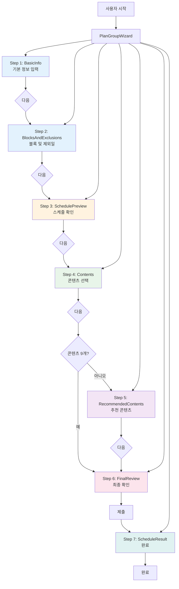

### 1.2 새로운 5단계 구조

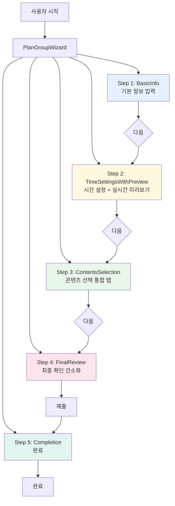

### 1.3 컴포넌트 계층 구조

```mermaid
graph TD
    PlanGroupWizard[PlanGroupWizard<br/>상태 관리 & 네비게이션]
    
    PlanGroupWizard --> Step1[Step1BasicInfoView]
    PlanGroupWizard --> Step2[Step2TimeSettingsView]
    PlanGroupWizard --> Step3[Step3ContentsView]
    PlanGroupWizard --> Step4[Step4FinalReviewView]
    PlanGroupWizard --> Step5[Step5CompletionView]
    
    Step1 --> BlockSetManager[BlockSetManager<br/>블록 세트 관리]
    Step1 --> DateRangePicker[DateRangePicker<br/>기간 선택]
    
    Step2 --> TimeSettingsPanel[TimeSettingsPanel<br/>시간 설정 입력]
    Step2 --> SchedulePreviewPanel[SchedulePreviewPanel<br/>실시간 미리보기]
    
    TimeSettingsPanel --> ExclusionsPanel[ExclusionsPanel<br/>제외일 관리]
    TimeSettingsPanel --> AcademyPanel[AcademyPanel<br/>학원 일정 관리]
    TimeSettingsPanel --> TimeConfigPanel[TimeConfigPanel<br/>시간 설정]
    
    SchedulePreviewPanel --> SummaryStats[SummaryStats<br/>요약 통계]
    SchedulePreviewPanel --> WeeklySchedule[WeeklySchedule<br/>주차별 스케줄]
    SchedulePreviewPanel --> DailySchedule[DailySchedule<br/>일별 스케줄]
    
    Step3 --> TabPanel[TabPanel<br/>탭 전환]
    TabPanel --> StudentContents[StudentContentsTab<br/>학생 콘텐츠]
    TabPanel --> RecommendedContents[RecommendedContentsTab<br/>추천 콘텐츠]
    
    Step4 --> CollapsibleSections[CollapsibleSections<br/>접기/펼치기 섹션]
    CollapsibleSections --> BasicInfoSection[BasicInfoSection]
    CollapsibleSections --> TimeSettingsSection[TimeSettingsSection]
    CollapsibleSections --> ContentsSection[ContentsSection]
    
    Step5 --> CompletionMessage[CompletionMessage<br/>완료 메시지]
    Step5 --> NextActions[NextActions<br/>다음 액션]
    
    style PlanGroupWizard fill:#e8eaf6
    style Step1 fill:#e3f2fd
    style Step2 fill:#fff8e1
    style Step3 fill:#e8f5e9
    style Step4 fill:#fce4ec
    style Step5 fill:#e0f2f1
```

---

## 2. 데이터 흐름 다이어그램

### 2.1 Wizard 데이터 흐름 (전체)

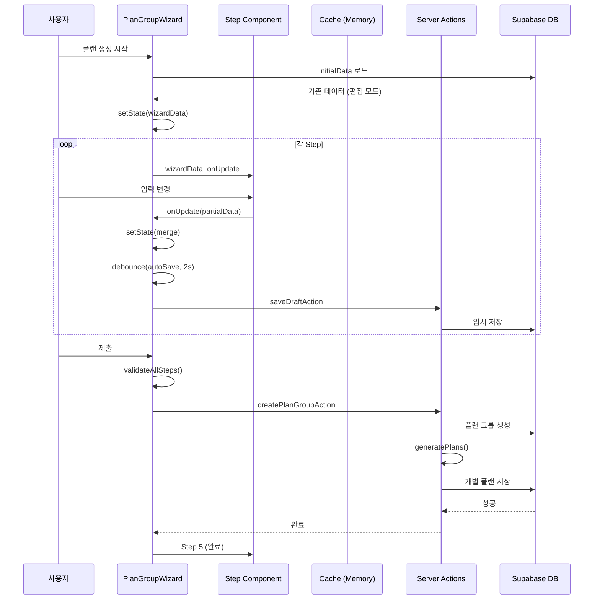

### 2.2 Step 2 실시간 미리보기 흐름

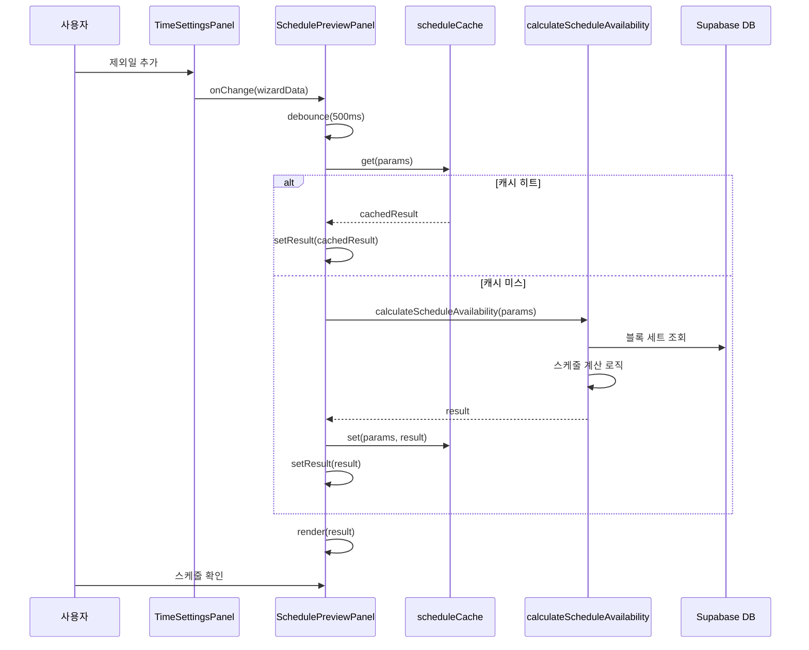

### 2.3 Step 3 콘텐츠 선택 흐름

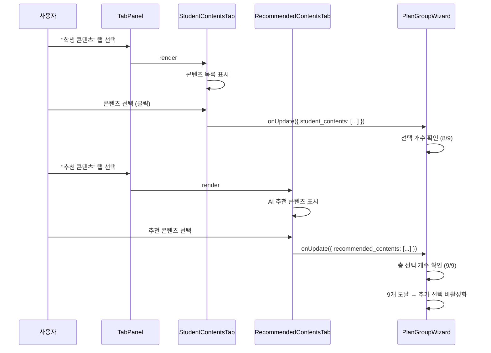

### 2.4 모드별 흐름 차이

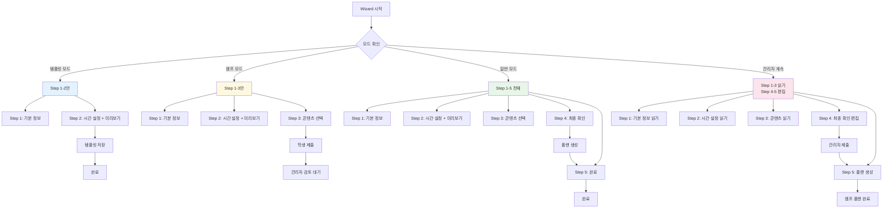

---

## 3. 상태 관리 구조

### 3.1 WizardData 상태 구조

```mermaid
graph TD
    WizardData[WizardData State]
    
    WizardData --> BasicInfo[Step 1: 기본 정보]
    WizardData --> TimeSettings[Step 2: 시간 설정]
    WizardData --> Schedule[Step 2: 스케줄 결과]
    WizardData --> Contents[Step 3: 콘텐츠]
    WizardData --> Template[템플릿 설정]
    
    BasicInfo --> name[name: string]
    BasicInfo --> purpose[plan_purpose: enum]
    BasicInfo --> period[period_start/end: string]
    BasicInfo --> blockSet[block_set_id: string]
    BasicInfo --> scheduler[scheduler_type: enum]
    
    TimeSettings --> exclusions[exclusions: array]
    TimeSettings --> academy[academy_schedules: array]
    TimeSettings --> timeConfig[time_settings: object]
    TimeSettings --> nonStudy[non_study_time_blocks: array]
    
    Schedule --> summary[schedule_summary: object]
    Schedule --> daily[daily_schedule: array]
    
    Contents --> student[student_contents: array]
    Contents --> recommended[recommended_contents: array]
    
    Template --> locked[templateLockedFields: object]
    
    style WizardData fill:#e8eaf6
    style BasicInfo fill:#e3f2fd
    style TimeSettings fill:#fff8e1
    style Schedule fill:#fff8e1
    style Contents fill:#e8f5e9
    style Template fill:#fce4ec
```

### 3.2 검증 흐름

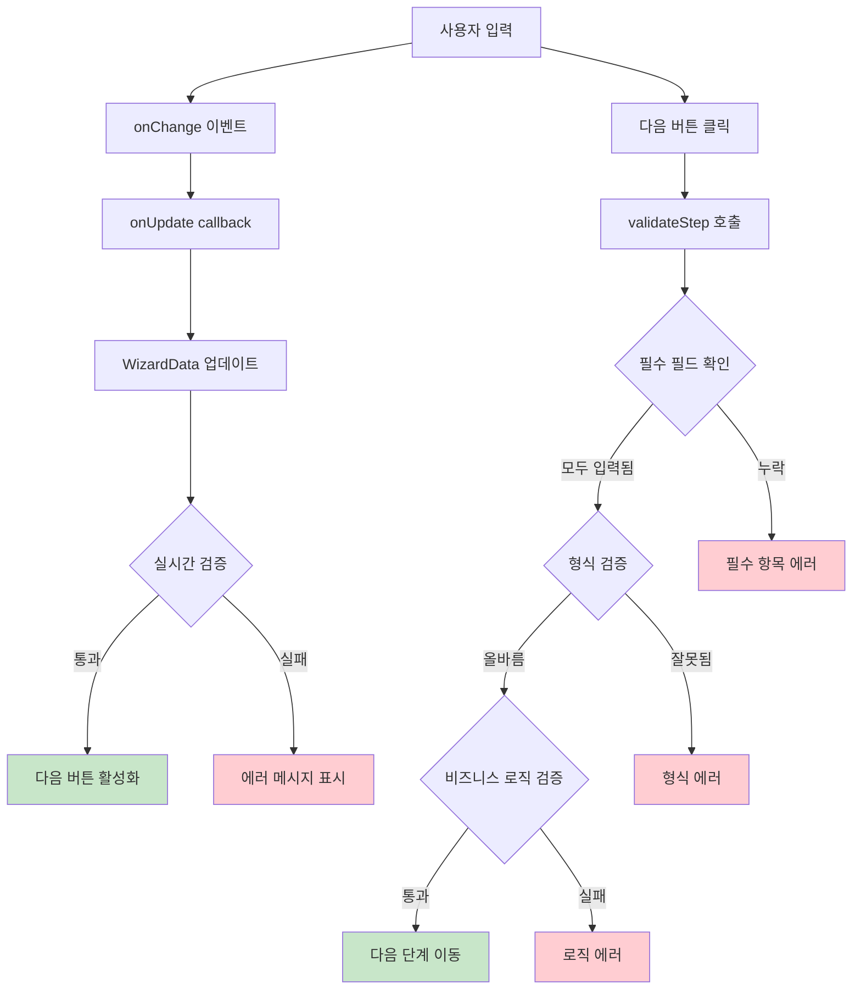

---

## 4. DetailView 통합 구조

### 4.1 mode prop 패턴

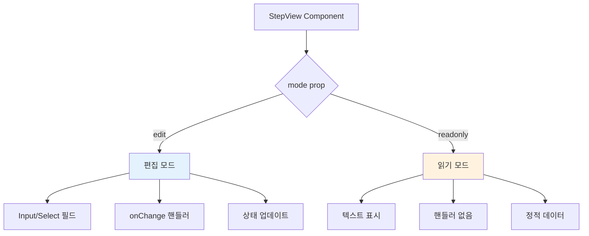

### 4.2 통합 전후 비교

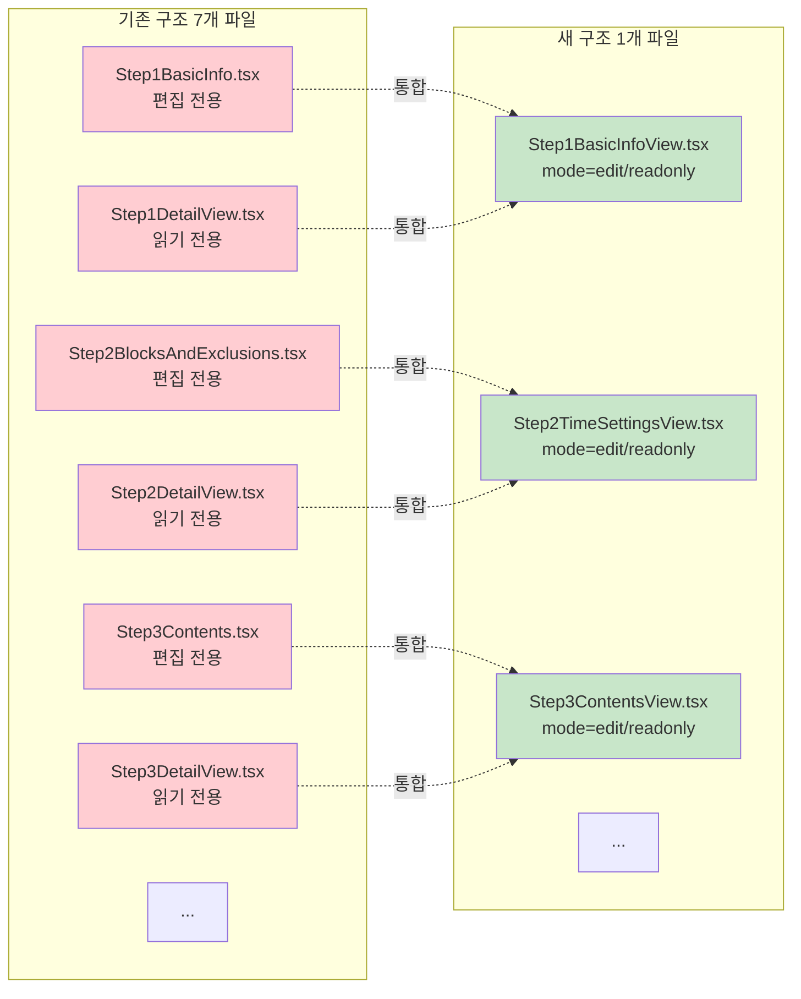

---

## 5. 성능 최적화 구조

### 5.1 렌더링 최적화

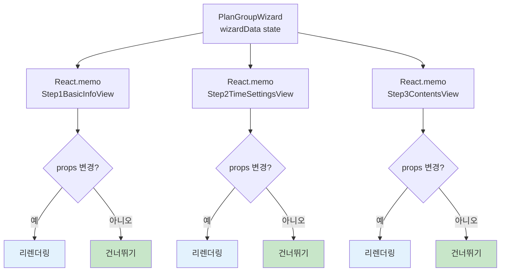

### 5.2 스케줄 계산 캐싱

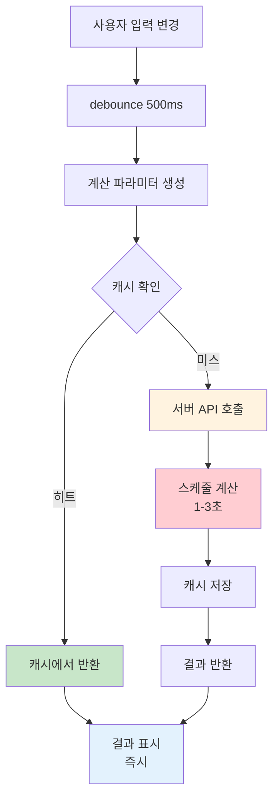

---

## 6. 구현 단계별 다이어그램

### Phase 2: Step 2+3 통합

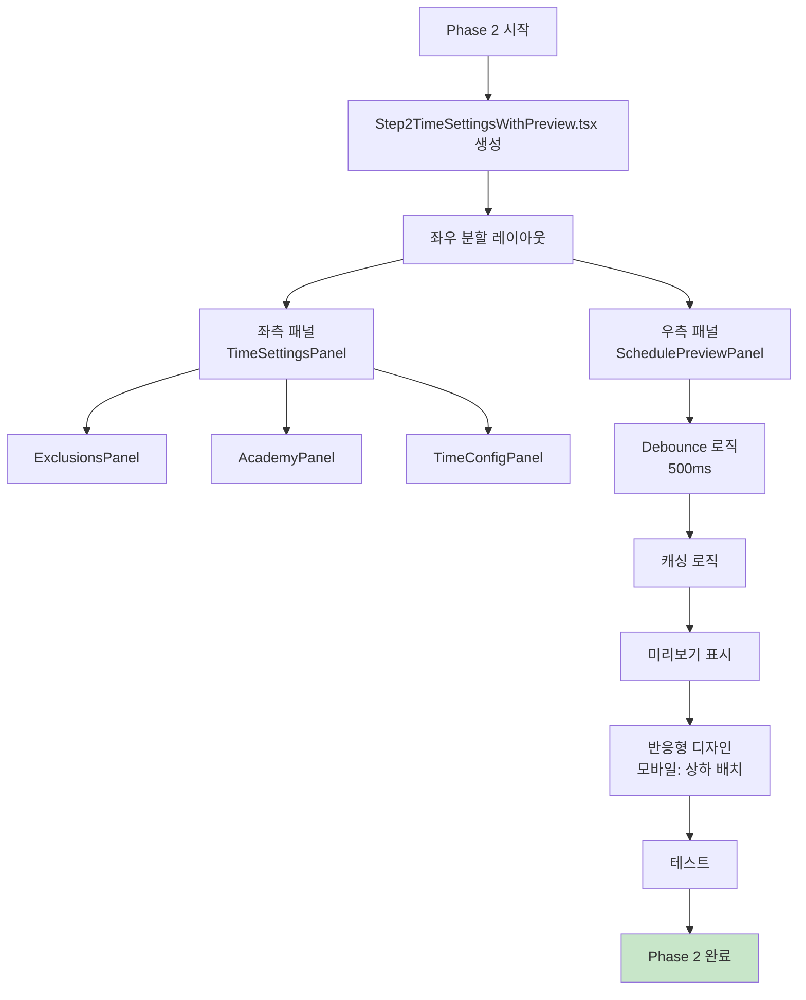

### Phase 3: Step 4+5 통합

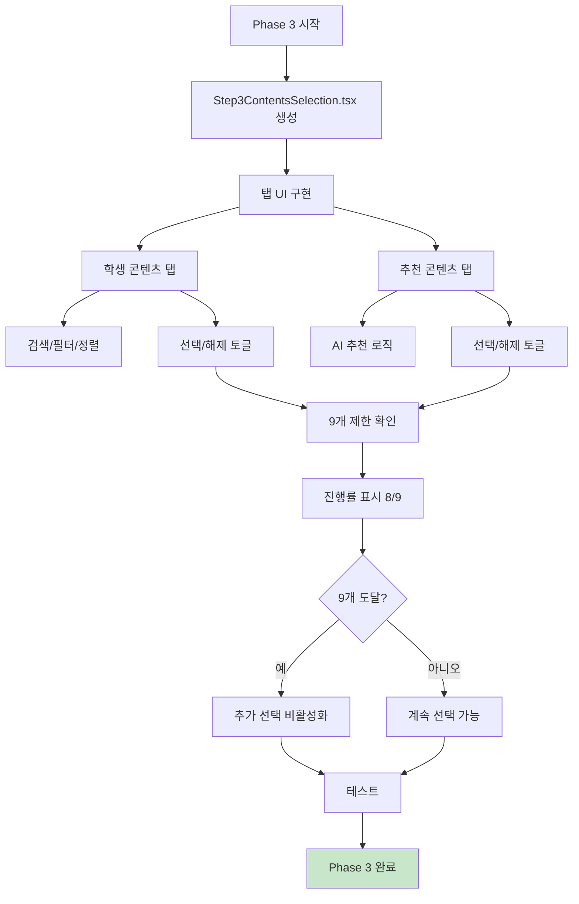

### Phase 5: DetailView 통합

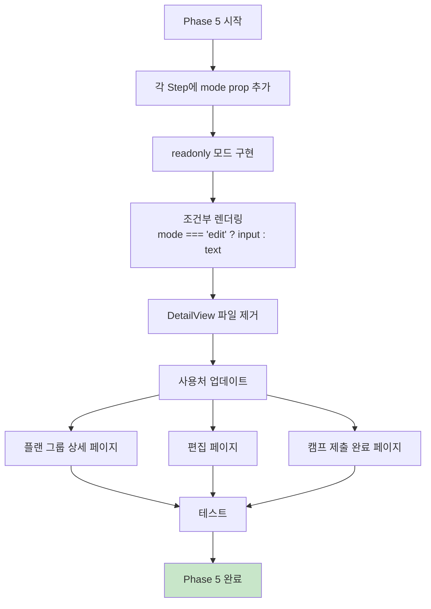

---

## 7. 에러 핸들링 구조

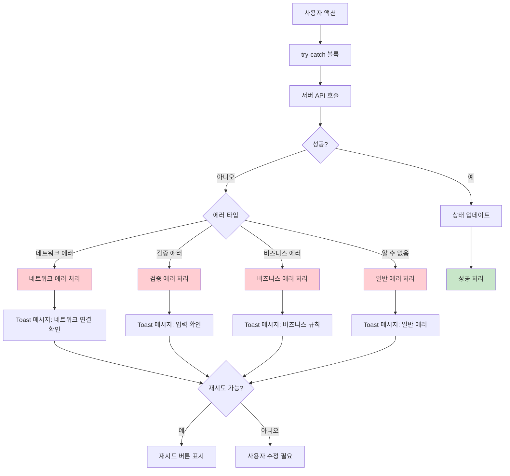

---

**참고 문서**:
- [상세 분석 문서](./wizard-refactoring-analysis.md)
- [프로젝트 계획](../camp-plan.plan.md)

