# 플랜 생성 과정 종합 가이드

## 작성일: 2025-01-17

---

## 📋 목차

1. [개요](#개요)
2. [전체 흐름도](#전체-흐름도)
3. [UI 플로우 (Wizard Steps)](#ui-플로우-wizard-steps)
4. [서버 사이드 플랜 생성 알고리즘](#서버-사이드-플랜-생성-알고리즘)
5. [주요 알고리즘 상세](#주요-알고리즘-상세)
6. [스켈레톤 UI](#스켈레톤-ui)
7. [데이터 구조](#데이터-구조)
8. [에러 처리](#에러-처리)
9. [성능 최적화](#성능-최적화)

---

## 개요

플랜 생성은 학생의 학습 계획을 자동으로 생성하는 핵심 기능입니다. 다음 두 가지 주요 단계로 구성됩니다:

1. **플랜 그룹 생성**: 사용자가 위저드를 통해 설정 정보 입력
2. **플랜 생성**: 서버에서 스케줄러 알고리즘을 통해 실제 학습 플랜 생성

### 주요 구성 요소

- **Wizard UI**: Step 1~7의 다단계 입력 인터페이스
- **SchedulerEngine**: 1730 타임테이블 알고리즘 구현
- **PlanSplitter**: 강의 콘텐츠 Episode별 분할
- **TimeAssigner**: 시간 슬롯 배정 (Bin Packing 유사)

---

## 전체 흐름도

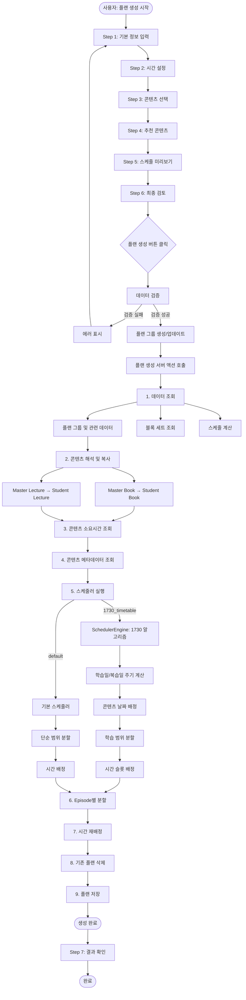

---

## UI 플로우 (Wizard Steps)

### Step 1: 기본 정보 입력

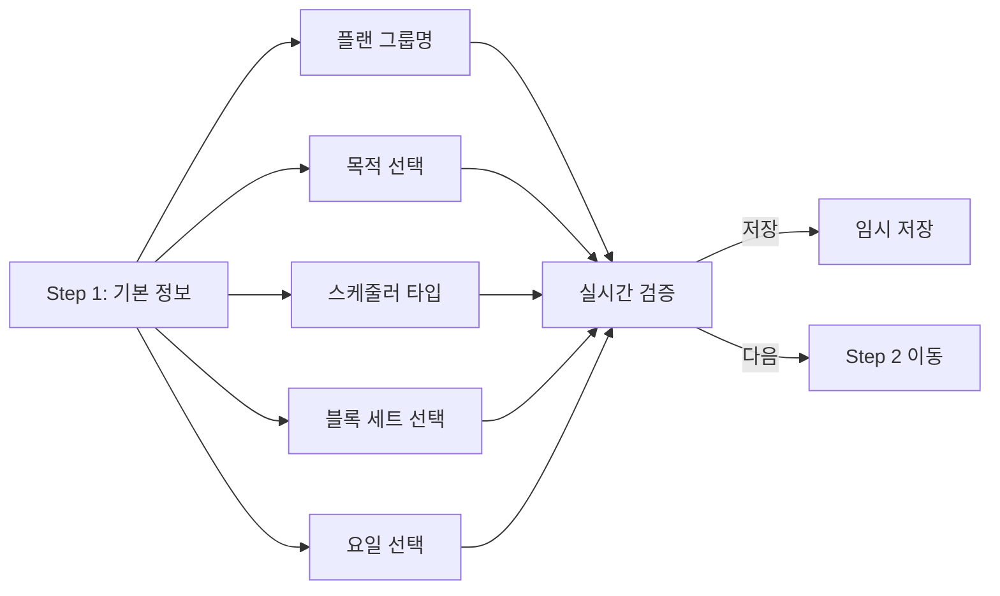

**주요 입력 항목:**
- 플랜 그룹명 (`name`)
- 목적 (`purpose`: "내신대비" | "모의고사(수능)")
- 스케줄러 타입 (`scheduler_type`: "1730_timetable")
- 블록 세트 ID (`block_set_id`)
- 요일 선택 (`weekdays`: number[])

**컴포넌트 위치:**
- `app/(student)/plan/new-group/_components/_features/basic-info/Step1BasicInfo.tsx`

---

### Step 2: 시간 설정

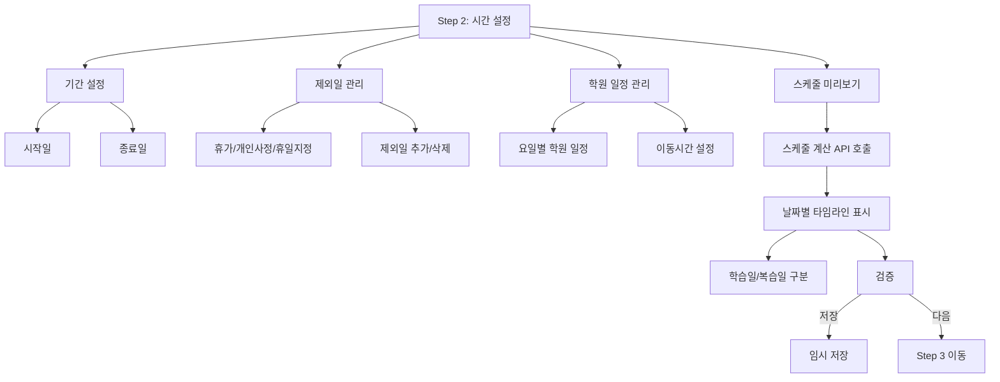

**주요 입력 항목:**
- 기간 시작일 (`period_start`)
- 기간 종료일 (`period_end`)
- 제외일 목록 (`exclusions`)
- 학원 일정 목록 (`academy_schedules`)

**스케줄 계산 결과:**
- `dateTimeSlots`: 날짜별 시간 슬롯 (학습시간/점심시간/학원일정/이동시간)
- `dateMetadataMap`: 날짜별 메타데이터 (day_type, week_number)
- `dateAvailableTimeRanges`: 날짜별 사용 가능한 시간 범위

**컴포넌트 위치:**
- `app/(student)/plan/new-group/_components/_features/scheduling/Step2TimeSettings.tsx`
- `app/(student)/plan/new-group/_components/_features/scheduling/Step3SchedulePreview.tsx`

---

### Step 3: 콘텐츠 선택

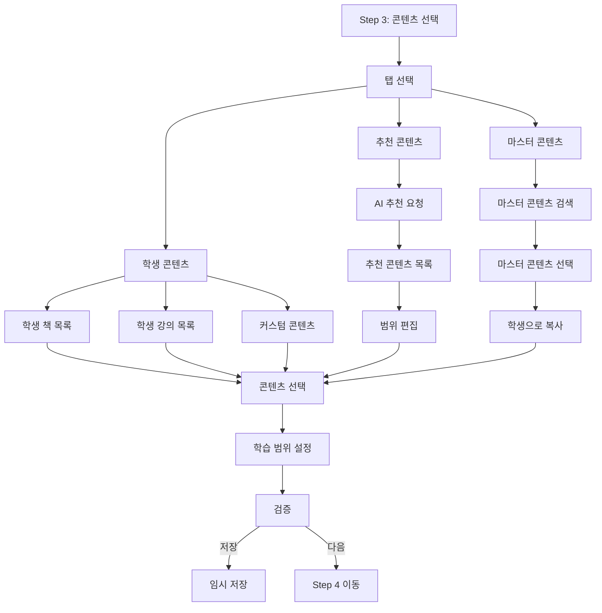

**주요 입력 항목:**
- 콘텐츠 목록 (`contents`)
  - `content_type`: "book" | "lecture" | "custom"
  - `content_id`: 콘텐츠 ID
  - `start_range`: 시작 범위 (페이지/회차)
  - `end_range`: 종료 범위 (페이지/회차)

**컴포넌트 위치:**
- `app/(student)/plan/new-group/_components/_features/content-selection/Step3ContentSelection.tsx`
- `app/(student)/plan/new-group/_components/_features/content-selection/Step4RecommendedContents/`

---

### Step 4: 추천 콘텐츠 (선택)

**AI 기반 추천 시스템:**
- 학생의 성적 데이터 분석
- 취약 과목 기반 추천
- 학습 범위 자동 계산

---

### Step 5: 스케줄 미리보기

**Step 2에서 이미 표시되지만, Step 5에서 최종 확인**

---

### Step 6: 최종 검토

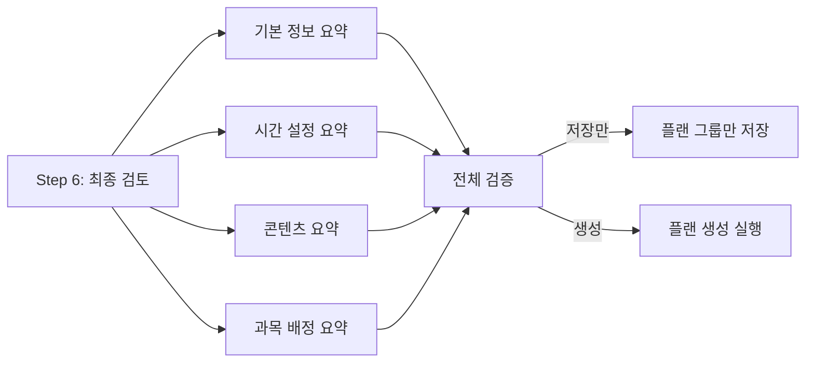

**컴포넌트 위치:**
- `app/(student)/plan/new-group/_components/_features/content-selection/Step6FinalReview.tsx`
- `app/(student)/plan/new-group/_components/_summary/`

---

### Step 7: 결과 확인

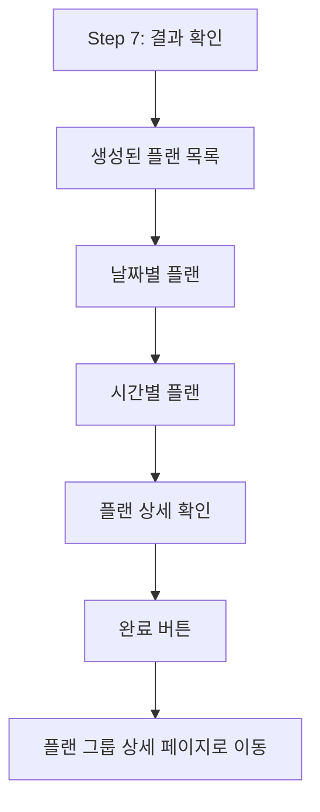

**컴포넌트 위치:**
- `app/(student)/plan/new-group/_components/_features/scheduling/Step7ScheduleResult.tsx`

---

## 서버 사이드 플랜 생성 알고리즘

### 메인 플랜 생성 함수

**파일 위치:**
- `app/(student)/actions/plan-groups/generatePlansRefactored.ts`

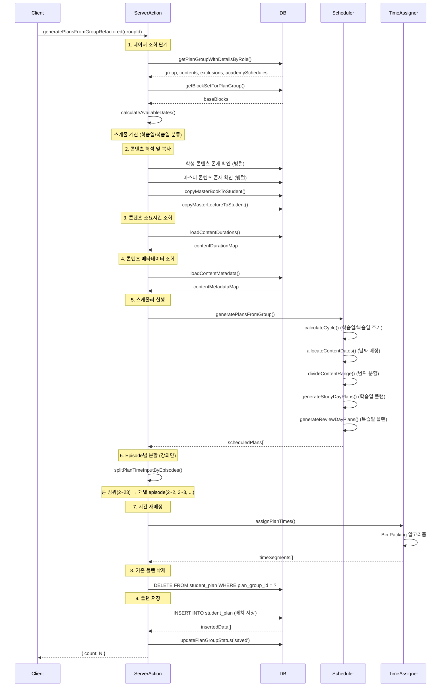

---

## 주요 알고리즘 상세

### 1. 학습일/복습일 주기 계산 알고리즘

**파일 위치:**
- `lib/plan/1730TimetableLogic.ts`

```typescript
function calculateStudyReviewCycle(
  periodStart: string,
  periodEnd: string,
  cycle: { study_days: number; review_days: number },
  exclusions: PlanExclusion[]
): CycleDayInfo[]
```

**알고리즘 흐름:**

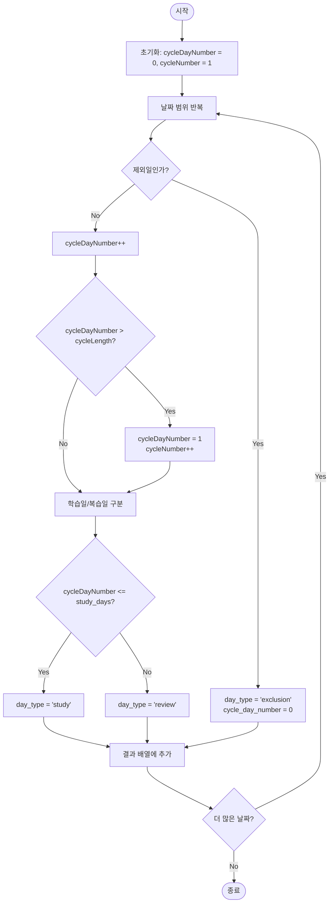

**예시:**
- `study_days = 6`, `review_days = 1`
- 주기 길이 = 7일
- 제외일은 주기에서 완전히 제외

```
2025-01-01 (월): 학습일 (cycle_day_number = 1)
2025-01-02 (화): 학습일 (cycle_day_number = 2)
2025-01-03 (수): 학습일 (cycle_day_number = 3)
2025-01-04 (목): 학습일 (cycle_day_number = 4)
2025-01-05 (금): 학습일 (cycle_day_number = 5)
2025-01-06 (토): 학습일 (cycle_day_number = 6)
2025-01-07 (일): 복습일 (cycle_day_number = 7)
2025-01-08 (월): 학습일 (cycle_day_number = 1, cycle_number = 2)
...
```

---

### 2. 콘텐츠 날짜 배정 알고리즘 (전략/취약 과목)

**파일 위치:**
- `lib/plan/1730TimetableLogic.ts`
- `lib/scheduler/SchedulerEngine.ts`

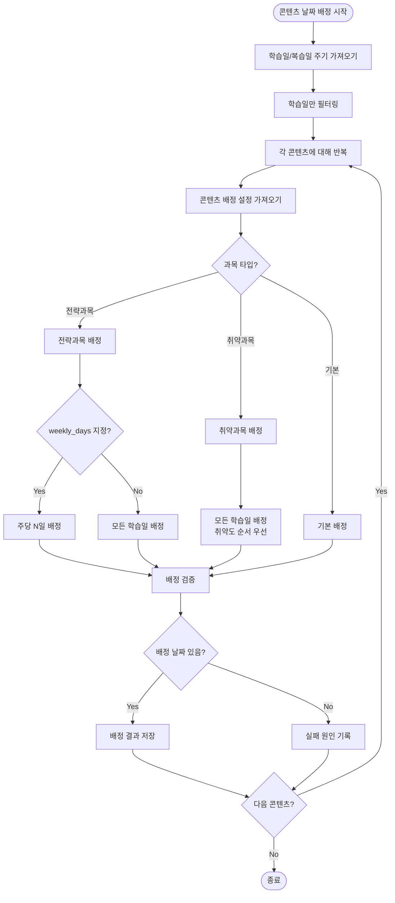

**전략과목 배정 예시:**
- `weekly_days = 2`: 주당 2일 배정
- 주차별로 균등 분배

```
주차 1:
  - 2025-01-01 (학습일 1)
  - 2025-01-03 (학습일 3)

주차 2:
  - 2025-01-08 (학습일 1)
  - 2025-01-10 (학습일 3)
...
```

---

### 3. 학습 범위 분할 알고리즘

**파일 위치:**
- `lib/plan/1730TimetableLogic.ts`

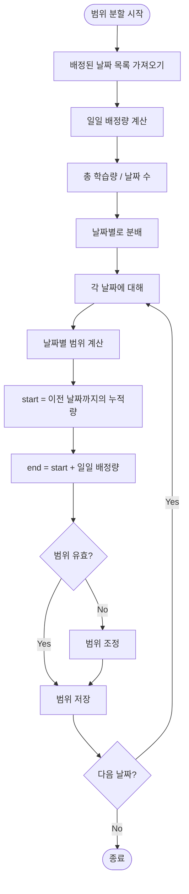

**예시:**
- 콘텐츠 범위: 1~100 페이지
- 배정 날짜: 5일

```
날짜 1: 1~20 (20페이지)
날짜 2: 21~40 (20페이지)
날짜 3: 41~60 (20페이지)
날짜 4: 61~80 (20페이지)
날짜 5: 81~100 (20페이지)
```

---

### 4. 시간 슬롯 배정 알고리즘 (Bin Packing 유사)

**파일 위치:**
- `lib/plan/assignPlanTimes.ts`
- `lib/scheduler/SchedulerEngine.ts`

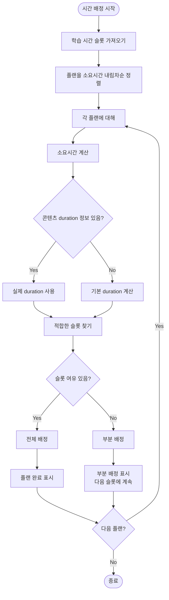

**Best Fit 알고리즘:**
1. 플랜을 소요시간 내림차순으로 정렬 (큰 것부터)
2. 각 플랜에 대해 가장 적합한 슬롯 찾기
3. 슬롯 여유가 부족하면 다음 슬롯으로 분할

**예시:**
```
시간 슬롯:
  - 09:00~12:00 (180분)
  - 14:00~18:00 (240분)

플랜:
  - 플랜 A: 120분 → 슬롯 1에 배정
  - 플랜 B: 90분 → 슬롯 1에 배정 (남은 60분)
  - 플랜 C: 100분 → 슬롯 1에 60분, 슬롯 2에 40분 (분할)
  - 플랜 D: 200분 → 슬롯 2에 배정
```

---

### 5. Episode별 분할 알고리즘 (강의 콘텐츠)

**파일 위치:**
- `lib/plan/planSplitter.ts`

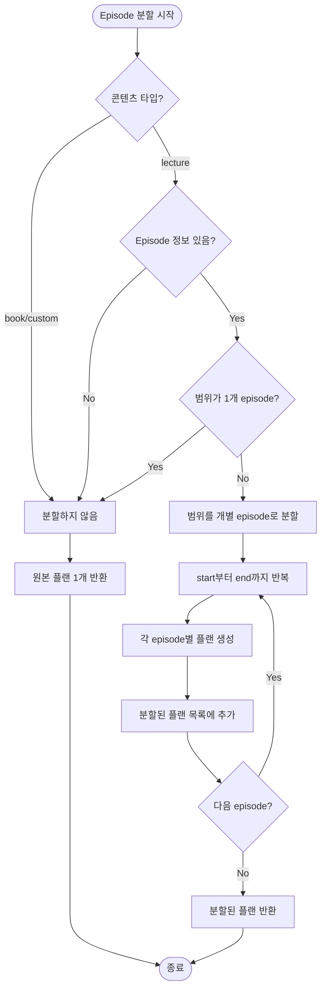

**예시:**
```
입력 플랜:
  - planned_start_page_or_time: 2
  - planned_end_page_or_time: 5

분할 결과:
  - 플랜 1: 2~2
  - 플랜 2: 3~3
  - 플랜 3: 4~4
  - 플랜 4: 5~5
```

**중요 사항:**
- 복습일인 경우 Episode별 분할하지 않음 (범위형 유지)
- 이미 단일 episode인 경우 (start === end) 재분할하지 않음

---

## 스켈레톤 UI

### 로딩 상태 표시 컴포넌트

**파일 위치:**
- `components/ui/LoadingSkeleton.tsx`
- `components/atoms/Skeleton.tsx`

**주요 Variant:**

1. **Schedule Skeleton** (스케줄 미리보기)
```tsx
<LoadingSkeleton variant="schedule" />
```

2. **Tab Skeleton** (탭 로딩)
```tsx
<LoadingSkeleton variant="tab" />
```

3. **Card Skeleton** (카드 로딩)
```tsx
<LoadingSkeleton variant="card" />
```

### 플랜 생성 중 스켈레톤 UI

**파일 위치:**
- `app/(student)/plan/group/[id]/_components/ScheduleLoadingSkeleton.tsx`

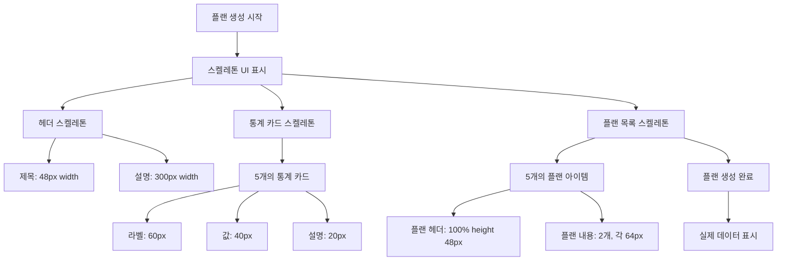

**컴포넌트 예시:**

```tsx
// SchedulePreviewPanel.tsx (로딩 상태)
if (loading) {
  return (
    <div className="flex flex-col gap-6">
      {/* 헤더 스켈레톤 */}
      <div className="flex flex-col gap-1">
        <Skeleton variant="text" height={28} width="200px" />
        <Skeleton variant="text" height={16} width="300px" />
      </div>

      {/* 요약 통계 스켈레톤 */}
      <div className="grid grid-cols-2 gap-4 md:grid-cols-5">
        {Array.from({ length: 5 }).map((_, i) => (
          <div key={i} className="flex flex-col gap-2 rounded-lg border border-gray-200 bg-white p-4">
            <Skeleton variant="rectangular" height={20} width="60px" />
            <Skeleton variant="text" height={32} width="40px" />
            <Skeleton variant="text" height={14} width="20px" />
          </div>
        ))}
      </div>

      {/* 주차별 스케줄 스켈레톤 */}
      <div className="flex flex-col gap-4">
        {Array.from({ length: 2 }).map((_, i) => (
          <div key={i} className="rounded-lg border border-gray-200 bg-white p-6">
            <Skeleton variant="text" height={24} width="150px" />
            <div className="mt-4 flex flex-col gap-2">
              {Array.from({ length: 3 }).map((_, j) => (
                <Skeleton key={j} variant="rectangular" height={80} />
              ))}
            </div>
          </div>
        ))}
      </div>
    </div>
  );
}
```

---

## 데이터 구조

### 플랜 그룹 (plan_groups)

```typescript
type PlanGroup = {
  id: string;
  tenant_id: string;
  student_id: string;
  name: string;
  purpose: "내신대비" | "모의고사(수능)" | null;
  scheduler_type: "1730_timetable" | "default";
  scheduler_options: SchedulerOptions;
  period_start: string;
  period_end: string;
  status: "draft" | "saved" | "active" | "completed";
  block_set_id: string | null;
  camp_template_id: string | null;
  camp_invitation_id: string | null;
};
```

### 플랜 콘텐츠 (plan_group_contents)

```typescript
type PlanContent = {
  id: string;
  plan_group_id: string;
  content_type: "book" | "lecture" | "custom";
  content_id: string;
  start_range: number;
  end_range: number;
  subject_type?: "strategy" | "weakness";
  weekly_days?: number;
};
```

### 학생 플랜 (student_plan)

```typescript
type StudentPlan = {
  id: string;
  plan_group_id: string;
  student_id: string;
  tenant_id: string;
  plan_date: string;
  block_index: number;
  content_type: "book" | "lecture" | "custom";
  content_id: string;
  planned_start_page_or_time: number;
  planned_end_page_or_time: number;
  chapter: string | null;
  start_time: string | null; // HH:mm
  end_time: string | null; // HH:mm
  day_type: "학습일" | "복습일" | null;
  week: number | null;
  day: number | null;
  is_partial: boolean;
  is_continued: boolean;
  status: "pending" | "running" | "completed" | "skipped";
  sequence: number | null;
};
```

---

## 에러 처리

### 에러 타입

**파일 위치:**
- `lib/errors/planGroupErrors.ts`
- `lib/errors/planGenerationErrors.ts`

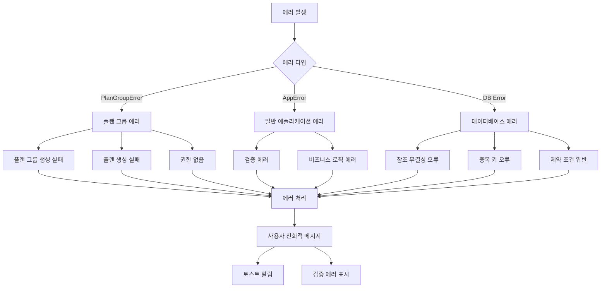

### 실패 원인 (Failure Reasons)

```typescript
type PlanGenerationFailureReason = {
  type: 
    | "no_study_days"
    | "content_allocation_failed"
    | "time_allocation_failed"
    | "no_plans_generated";
  contentId?: string;
  contentType?: string;
  reason: string;
  // ... 기타 필드
};
```

**에러 처리 예시:**

```typescript
// generatePlansRefactored.ts
try {
  scheduledPlans = await generatePlansFromGroup(...);
} catch (error) {
  if (error instanceof PlanGroupError) {
    const userMessage = error.userMessage || error.message;
    throw new AppError(
      userMessage,
      ErrorCode.BUSINESS_LOGIC_ERROR,
      400,
      true,
      {
        originalError: error.message,
        failureReason: error.failureReason,
        code: error.code,
      }
    );
  }
  throw error;
}
```

---

## 성능 최적화

### 1. 배치 쿼리

```typescript
// 병렬 쿼리 실행
const [existingBooksResult, existingLecturesResult] = await Promise.all([
  bookContents.length > 0
    ? queryClient.from("books").select("id, master_content_id")
        .in("master_content_id", bookContents.map(c => c.content_id))
        .eq("student_id", studentId)
    : Promise.resolve({ data: [] }),
  lectureContents.length > 0
    ? queryClient.from("lectures").select("id, master_content_id")
        .in("master_content_id", lectureContents.map(c => c.content_id))
        .eq("student_id", studentId)
    : Promise.resolve({ data: [] }),
]);
```

### 2. Episode Map 캐싱

```typescript
// SchedulerEngine.ts
const episodeMapCache = new Map<string, Map<number, number>>();

// Episode 정보 재사용
let episodeMap = episodeMapCache.get(content.content_id);
if (!episodeMap) {
  episodeMap = new Map();
  durationInfo.episodes.forEach(ep => {
    episodeMap.set(ep.episode_number, ep.duration || DEFAULT_EPISODE_DURATION);
  });
  episodeMapCache.set(content.content_id, episodeMap);
}
```

### 3. 배치 삽입

```typescript
// 플랜 일괄 저장
const { error: insertError, data: insertedData } = await supabase
  .from("student_plan")
  .insert(planPayloads) // 배열로 일괄 삽입
  .select();
```

### 4. 불필요한 재계산 방지

```typescript
// SchedulerEngine 클래스 내부 캐싱
private cycleDays: CycleDayInfo[] | null = null;
private contentAllocationMap: Map<string, string[]> | null = null;

public calculateCycle(): CycleDayInfo[] {
  if (this.cycleDays) return this.cycleDays; // 캐시된 값 반환
  // ... 계산 로직
  this.cycleDays = result;
  return result;
}
```

---

## MVP 이해 체크리스트

### 핵심 개념 이해

- [ ] **플랜 그룹**: 여러 플랜을 묶는 상위 개념
- [ ] **플랜**: 개별 학습 계획 (날짜, 시간, 콘텐츠 범위 포함)
- [ ] **스케줄러**: 플랜을 생성하는 알고리즘 엔진
- [ ] **블록**: 시간대 단위 (예: 09:00~12:00)
- [ ] **학습일/복습일**: 1730 타임테이블의 주기 개념

### 주요 알고리즘 이해

- [ ] 학습일/복습일 주기 계산 로직
- [ ] 전략/취약 과목 배정 로직
- [ ] 학습 범위 분할 알고리즘
- [ ] 시간 슬롯 배정 (Bin Packing 유사)
- [ ] Episode별 분할 (강의 콘텐츠)

### 데이터 흐름 이해

- [ ] Wizard → Server Action → Scheduler → Database
- [ ] Master 콘텐츠 → Student 콘텐츠 복사 과정
- [ ] ScheduledPlan → StudentPlan 변환 과정

### UI 흐름 이해

- [ ] Step 1~7의 각 단계 역할
- [ ] 임시 저장 (Draft) 메커니즘
- [ ] 스켈레톤 UI 표시 시점

---

## 참고 문서

- `docs/refactoring/plan_flow_documentation.md`: 전체 플로우 문서
- `timetable/1730Timetable-PRD.md`: 1730 타임테이블 요구사항
- `lib/plan/1730TimetableLogic.ts`: 1730 알고리즘 구현
- `lib/scheduler/SchedulerEngine.ts`: 스케줄러 엔진 구현

---

**마지막 업데이트**: 2025-01-17
