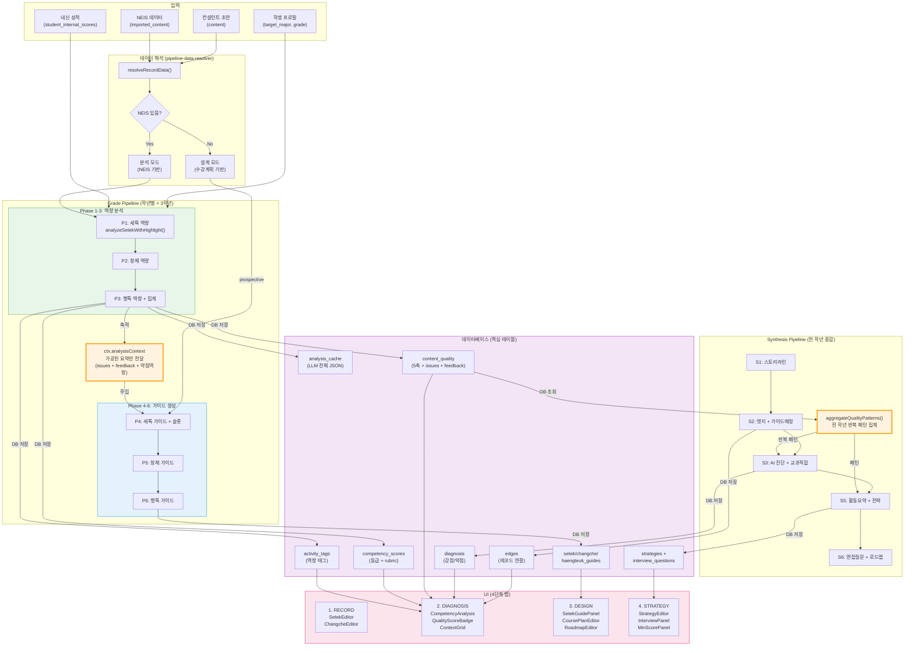
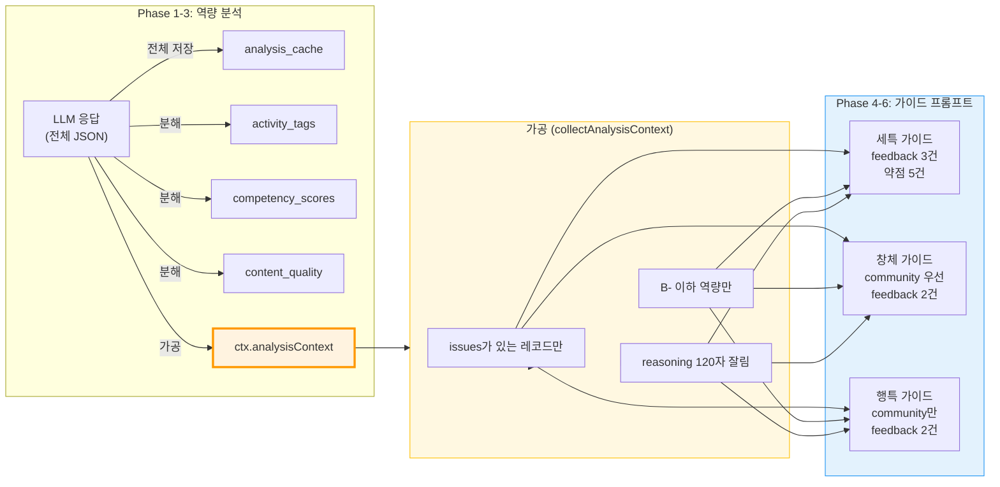
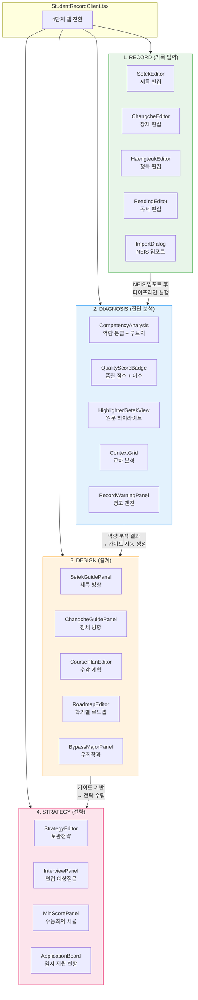
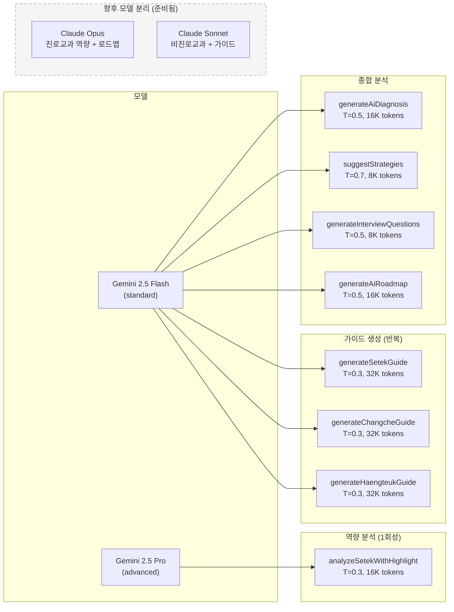
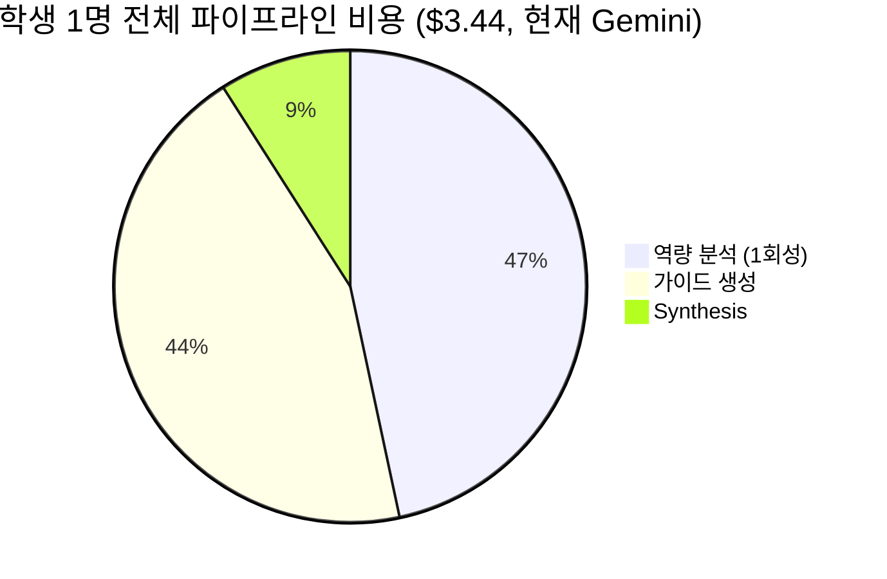
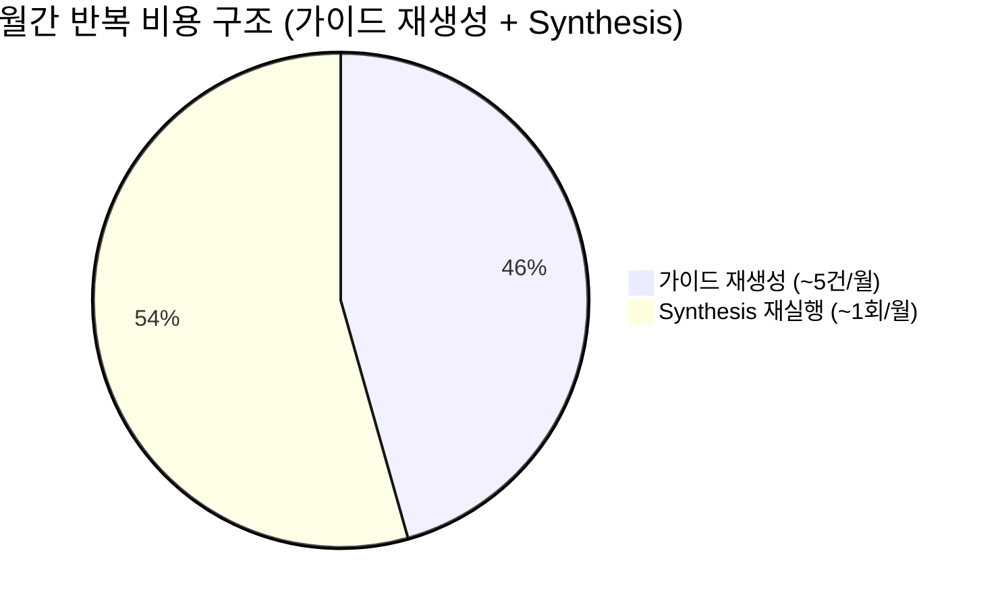
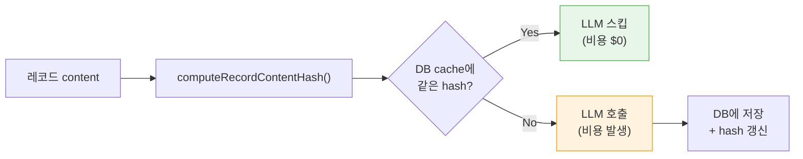

# 생기부 시스템 청사진

## 1. 전체 파이프라인 흐름

---

## 2. Phase 간 데이터 전달 상세

---

## 3. 학년별 Grade Pipeline 실행 순서

```mermaid
gantt
    title Grade Pipeline (1학년 예시)
    dateFormat X
    axisFormat %s초

    section Phase 1 (세특 역량)
    물리학I 분석     :p1a, 0, 70
    수학I 분석       :p1b, 0, 70
    영어Ⅰ 분석      :p1c, 0, 70
    지구과학I 분석   :p1d, 70, 140
    문학 분석        :p1e, 70, 140
    일본어Ⅰ 분석    :p1f, 70, 140
    나머지 (동시 3건) :p1g, 140, 210

    section Phase 2 (창체 역량)
    자율활동         :p2a, 210, 280
    동아리           :p2b, 210, 280
    진로활동         :p2c, 210, 280

    section Phase 3 (행특 역량)
    행특 분석+집계   :p3a, 280, 350

    section Phase 4 (세특 가이드)
    물리학I 가이드   :p4a, 350, 400
    수학I 가이드     :p4b, 350, 400
    영어Ⅰ 가이드    :p4c, 350, 400
    나머지 가이드    :p4d, 400, 450

    section Phase 5 (창체 가이드)
    창체 방향        :p5a, 450, 500

    section Phase 6 (행특 가이드)
    행특 방향        :p6a, 500, 550
```

---

## 4. DB 테이블 관계

```mermaid
erDiagram
    students ||--o{ student_record_seteks : "has"
    students ||--o{ student_record_changche : "has"
    students ||--o{ student_record_haengteuk : "has"
    students ||--o{ student_internal_scores : "has"

    student_record_seteks ||--o| student_record_analysis_cache : "cached"
    student_record_seteks ||--o{ student_record_activity_tags : "tagged"
    student_record_seteks ||--o| student_record_content_quality : "scored"
    student_record_seteks ||--o| student_record_setek_guides : "guided"

    student_record_changche ||--o| student_record_analysis_cache : "cached"
    student_record_changche ||--o{ student_record_activity_tags : "tagged"
    student_record_changche ||--o| student_record_changche_guides : "guided"

    student_record_haengteuk ||--o| student_record_analysis_cache : "cached"
    student_record_haengteuk ||--o{ student_record_activity_tags : "tagged"
    student_record_haengteuk ||--o| student_record_haengteuk_guides : "guided"

    students ||--o{ student_record_competency_scores : "graded"
    students ||--o| student_record_diagnosis : "diagnosed"
    students ||--o{ student_record_edges : "connected"
    students ||--o{ student_record_storylines : "storylined"
    students ||--o{ student_record_strategies : "strategized"
    students ||--o{ student_record_interview_questions : "interviewed"
    students ||--o{ student_record_analysis_pipelines : "pipelined"

    student_record_analysis_cache {
        uuid record_id PK
        jsonb analysis_result
        text content_hash
        text source
    }

    student_record_content_quality {
        uuid record_id PK
        int overall_score
        text[] issues
        text feedback
        int specificity
        int coherence
        int depth
        int grammar
        int scientific_validity
    }

    student_record_competency_scores {
        uuid student_id
        text competency_item
        text grade_value
        text narrative
        jsonb rubric_scores
    }

    student_record_analysis_pipelines {
        uuid id PK
        text status
        jsonb tasks
        jsonb task_previews
        jsonb task_results
        text pipeline_type
        int grade
    }
```

---

## 5. UI 4단계 탭 구조

---

## 6. LLM 호출 맵

---

## 7. 비용 구조

---

## 8. 증분 캐시 플로우

> **핵심**: 레코드 내용이 변경되지 않으면 재실행해도 LLM 호출 0건, 비용 $0.
> content_hash = `SHA256(content + targetMajor + takenSubjects)`
